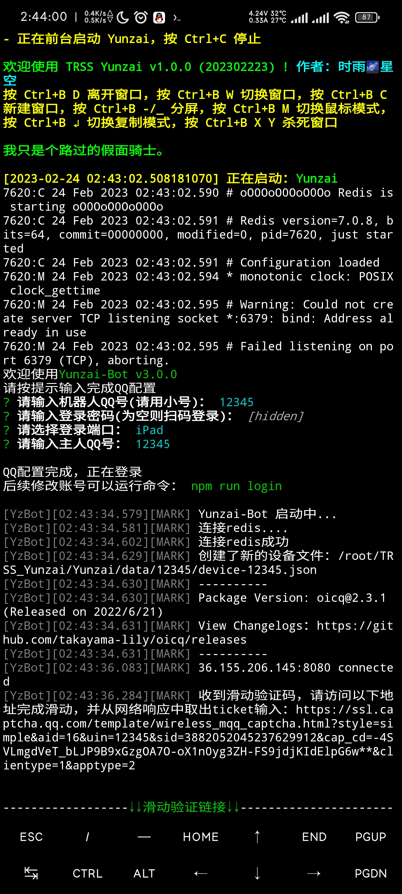

# 云崽BOT手机搭建教程(施工中)

#### 0.介绍
针对安卓手机搭建[云崽BOT](https://gitee.com/Le-niao/Yunzai-Bot)的一篇详细教程，也包含手机搭建前后会遇到的各种问题和解决方案。
|  搭建必备 |  有的话最好 |
|---|---|
|  安卓手机 网络|   vbn 遇到问题先搜索的好习惯 |

个人建议在空闲存储空间大于32G的手机上进行搭建。以下教程演示用的是红米K50(8+256)，使用时雨的[TRSS 脚本](https://trss.me/)搭建。

#### 1.[Termux](https://f-droid.org/en/packages/com.termux/)

下载安装

[点此下载TERMUX最新版本](https://f-droid.org/repo/com.termux_118.apk)。如果点击后无法正常下载可以加一下这篇文章结尾的[QQ群](http://jq.qq.com/?_wv=1027&k=tqiOtCVc)，我会上传到群文件。

下载后安装并打开此应用

打开以后应该长这样，后面就叫他Termux终端了。

基本使用说明

如果没有跳出键盘，点击屏幕空白区域即可，还是没有的话就从左侧滑出侧边栏再点击KEYBOARD

假设后续因为某些原因发生了无法解决的问题，你只需要清除Termux的全部数据即可。手机不支持清除数据的话可以卸载重装。

安装openssh

如果你不知道openssh是什么的话，可以试着搜索。还是不明白的话这部分你应该用不上，可以收起该部分，跳到下一步：2.容器。

进入Termux终端，输入`termux-change-repo`。如果手机打指令太慢或者怕打错的话多用截图左下角用红框框柱的那个的按钮，他能帮你补全大部分代码。

发送后你会来到这样一个可以点击交互的界面。先点击OK，再点击最下面的镜像，再点击OK，最后的输出如图。如果看文字不清楚的话可以看图，跟着图片的步骤点击就行。

确认上一步完成后，输入`pkg update -y`。中间他会停下来几次问你要选择哪种操作，你每次都输入一个大写的Y就行。

确认上一步完成后，输入`pkg install openssh -y`。最后输出以下内容就是安装openssh成功了。

输入`passwd`配置密码，输入`sshd`启动openssh。

如果你完全不了解openssh，只是因为我写了就跟着操作的话，我建议阅读[这篇文章](https://blog.csdn.net/qq_45740348/article/details/115602001)

#### 2.容器

脚本安装Arch

进入Termux终端。输入`curl -LO gitee.com/TimeRainStarSky/TRSS-MTArch/raw/main/Install.sh && bash Install.sh`，稍作等待会显示如下页面，说明容器安装完毕。

#### 3.云崽本体

安装管理脚本

进入Termux终端。输入`bash <(curl -L gitee.com/TimeRainStarSky/TRSS_Yunzai/raw/main/Install.sh)`，稍作等待会显示如下页面，说明时雨脚本安装完毕。

安装云崽

如果有vbn建议这一步开启。根据提示输入`tsyz`，首次启动脚本等待时间会稍久，背景变蓝说明成功进入脚本了。国内可能会导致部分报错信息遮住确认键，按我下面的截图点击对应位置即可。依次点击Yunzai、确认、确认、回车。

极少数情况会发生依赖安装失败，这时根据脚本提示再次安装即可。至此，云崽本体被成功安装。

接下来退出脚本。如果你懒得点直接杀termux后台也可以，再启动即可。

云崽换源

由于乐神云崽似乎暂时停更了，我们手动换喵喵的云崽已获取大佬的维护。进入Termux终端。输入`Arch/start`进入容器。

进入容器后输入`cd TRSS_Yunzai/Yunzai/`进入到云崽根目录，再输入`git remote set-url origin https://gitee.com/yoimiya-kokomi/Yunzai-Bot.git`即可完成换源。可以输入`git remote -v`做最后确认，输出和我完全一致就是成功了。

启动云崽

根据提示配置你的bot账密，登录方式建议iPad。

#### 4.推荐插件
#### 5.可选插件
#### 1.安装Termux
#### 1.安装Termux
#### canvas

pacman -S pkg-config

1.  Fork 本仓库
2.  新建 Feat_xxx 分支
3.  提交代码
4.  新建 Pull Request

#### 测试环境
如果你的手机环境跟我完全一致，则基本不可能出现本教程未涵盖的情况。

小米8(8+128) 系统版本：[MIUI12.5.2](https://xiaomirom.com/download/mi-8-dipper-stable-V12.5.2.0.QEACNXM/)

红米k40(12+256) 系统版本：[MIUI13.0.7](https://xiaomirom.com/download/redmi-k40-mi-11x-poco-f3-alioth-stable-V13.0.7.0.SKHCNXM/) 乌堆MIUI开发版14.0.23 [MIUI14.0.5](https://xiaomirom.com/download/redmi-k40-mi-11x-poco-f3-alioth-stable-V14.0.5.0.TKHCNXM/)

红米k50(8+256) 系统版本：[MIUI13.0.13](https://xiaomirom.com/download/redmi-k50-rubens-stable-V13.0.13.0.SLNCNXM/) 乌堆MIUI13.0.13

#### 参考信息
大量内容我只是搬运，以下是实际来源网页。
当然我不保证我发的这些信息本身就是原创信息，没兴趣甄别。
为啥这么杂？问就是百度。

[git换源1](https://blog.csdn.net/qq_45723638/article/details/123494464)
[git换源2](https://blog.csdn.net/as8996606/article/details/124879105)
[部分依赖](https://blog.csdn.net/qq_39099905/article/details/125228920)
[pacman](https://zhuanlan.zhihu.com/p/383694450)
[README润色](https://gitee.com/TimeRainStarSky/TRSS-Plugin/edit/main/README.md)

### 遇到问题/需要联系我/需要使用Bot

群号 **638077675** 

答案  **火花骑士** 

