# [V3云崽BOT手机搭建教程](https://gitee.com/CUZNIL/Yunzai-install)
上次编辑时间2023年4月23日14:18:19
## 0.介绍
针对安卓手机搭建[V3云崽BOT](https://gitee.com/Le-niao/Yunzai-Bot)的一篇详细教程，也包含手机搭建前后会遇到的各种问题和解决方案。


[本文Github页面](http://github.com/CUZNIL/Yunzai-install) [本文Gitee页面](https://gitee.com/CUZNIL/Yunzai-install)

| 搭建必备    | 有的话最好           | 不支持   | 不建议使用                      |
|---------|-----------------|-------|----------------------------|
| 安卓手机 网络 | vbn 遇到问题先搜索的好习惯 | 32位系统 | 空闲存储空间小于32G MIUI14 vivo系手机 |
<details><summary>为什么不建议？</summary>

1. **32位系统** ：该教程为了简化步骤直接使用时雨脚本，安装过程不支持32位系统。如果不知道自己手机是不是32位，可以先跟教程试试，如在安装容器时遇下图相同报错则说明是32位。

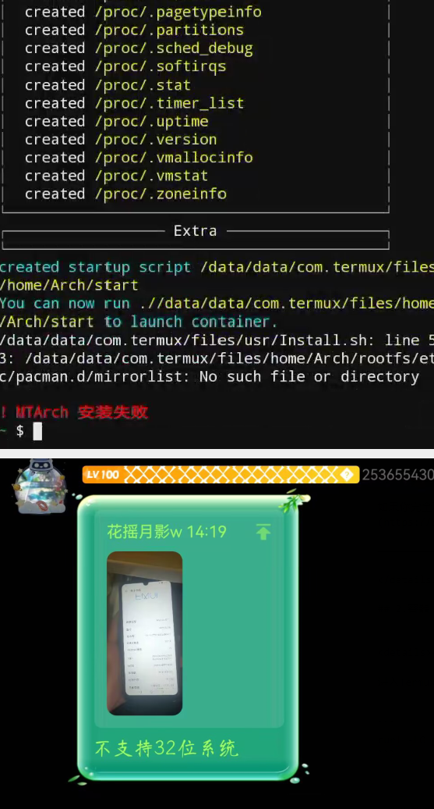

2. **空闲存储空间小于32G** ：云崽本体用不到那么大容量，但是为了你愉快地下载bot需要的资源，以及为了不出一些意料之外的问题，十分建议保证容量充足！不足当然也可以尝试，不保证成功。

3. **MIUI14** ：MIUI14使用安卓13，锅巴插件会报错找不到系统信息，其他插件也可能有类似问题，总之不建议使用。如需装载bot，建议先将机子降级为MIUI13，以免后续bug难以处理。尚不方便验证其他系手机的安卓13会不会有类似问题。

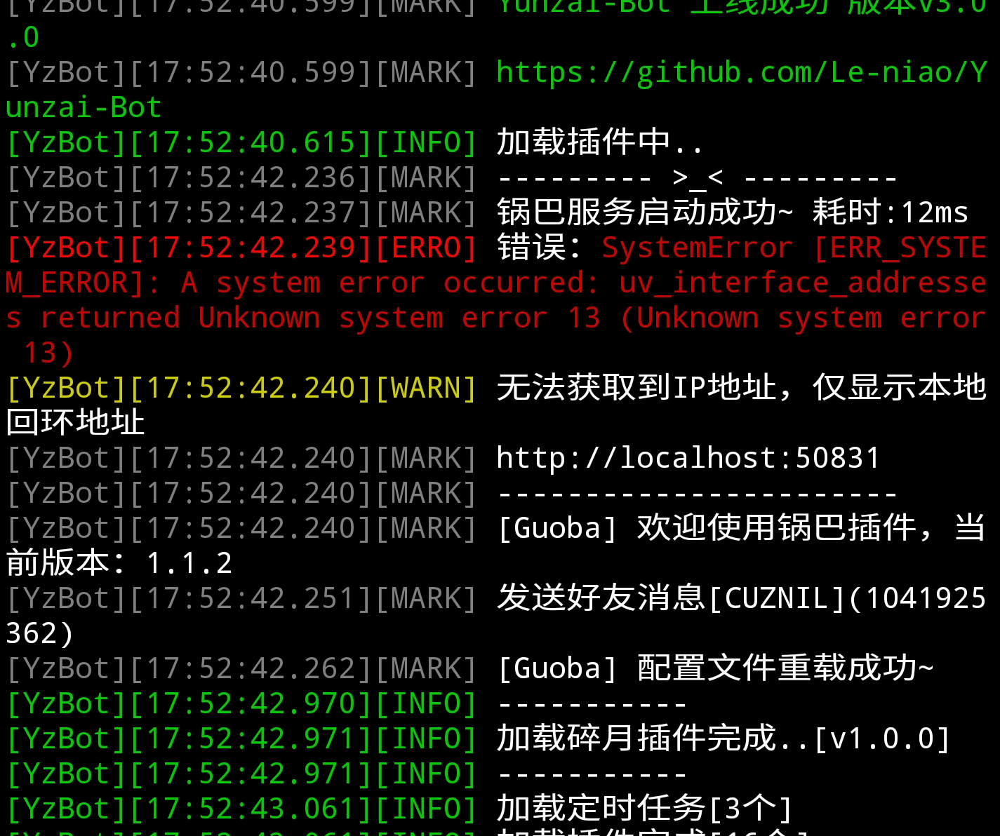

4. **vivo系手机** ：vivo的超级省电模式使用`termux-wake-lock`后前台息屏挂机依旧会杀后台，可能是vivo故意的。总之不推荐。当然如果你愿意保持亮屏的话也许没问题？开发者选项→充电时不息屏。


———————————分割线———————————
</details>


如果你已经成功搭建，只是遇到一些问题，可以直接阅读[接近文末的7.部分报错处理整合](../../../Yunzai-install#7%E9%83%A8%E5%88%86%E6%8A%A5%E9%94%99%E5%A4%84%E7%90%86%E6%95%B4%E5%90%88)。

虽然是手机教程，但是服务器搭建电脑搭建也可以参考。如需非手机脚本请自行访问[时雨网页](https://trss.me/)获取。

以下教程演示用的是红米K50(8+256)，使用时雨的[TRSS 脚本](https://trss.me/)搭建。

## 1.[Termux](https://f-droid.org/en/packages/com.termux/)


<details><summary>下载安装</summary>


[点此下载TERMUX最新版本](https://f-droid.org/repo/com.termux_118.apk)。

**备用方案：**[QQ群文件](http://jq.qq.com/?_wv=1027&k=tqiOtCVc) [天翼网盘(访问码：u9g9)](https://cloud.189.cn/t/rY3ueeYzENBj) [gitee下载](https://gitee.com/CUZNIL/Yunzai-install/raw/master/download/apks/Termux_0.118.0_com.termux_118.apk) [github下载](https://github.com/CUZNIL/Yunzai-install/raw/master/download/apks/Termux_0.118.0_com.termux_118.apk) [GHProxy下载](https://ghproxy.com/https://raw.githubusercontent.com/CUZNIL/Yunzai-install/master/download/apks/Termux_0.118.0_com.termux_118.apk) 

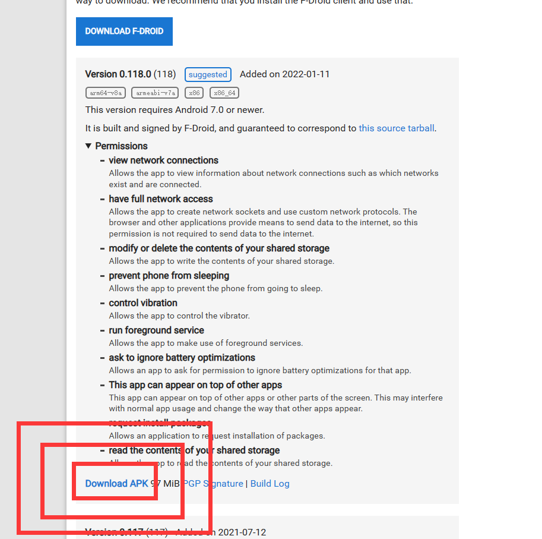


下载后安装并打开此应用


打开以后应该长这样，后面就叫他Termux终端了。

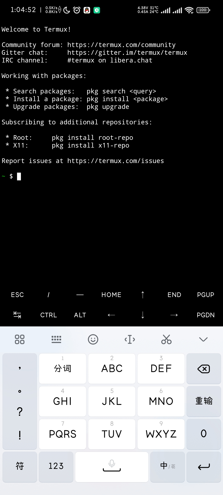

———————————分割线———————————

</details>


<details><summary>基本使用说明</summary>


如果没有跳出键盘，点击屏幕空白区域即可，还是没有的话就从左侧滑出侧边栏再点击KEYBOARD

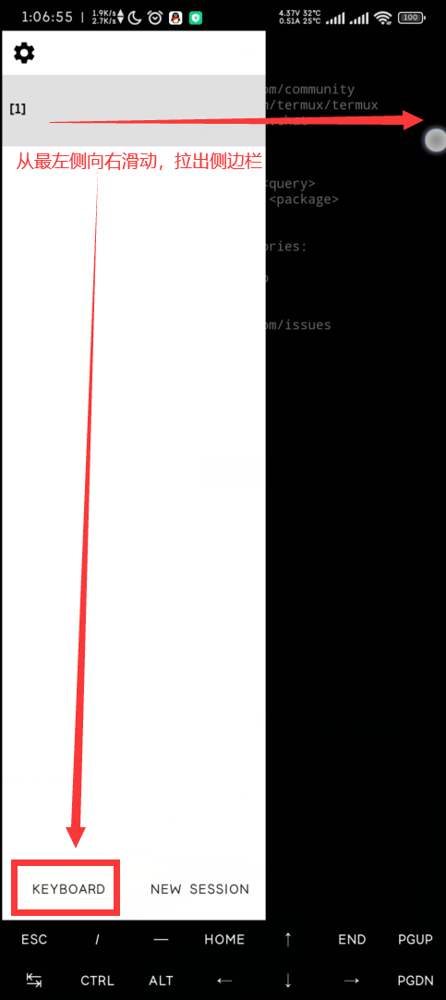

假设后续因为某些原因发生了无法解决的问题，你只需要清除Termux的全部数据即可。手机不支持清除数据的话可以卸载重装。

———————————分割线———————————

</details>

<details><summary>安装openssh（可选）</summary>

如果你不知道openssh是什么的话，可以试着搜索。还是不明白的话这部分你应该用不上， **可以收起该部分，跳到下一步：2.容器。** 

进入Termux终端，输入`termux-change-repo`。如果手机打指令太慢或者怕打错的话多用截图左下角用红框框柱的那个的按钮，他能帮你补全大部分代码。


发送后你会来到这样一个可以点击交互的界面。先点击OK，再点击最下面的镜像，再点击OK，最后的输出如图。如果看文字不清楚的话可以看图，跟着图片的步骤点击就行。

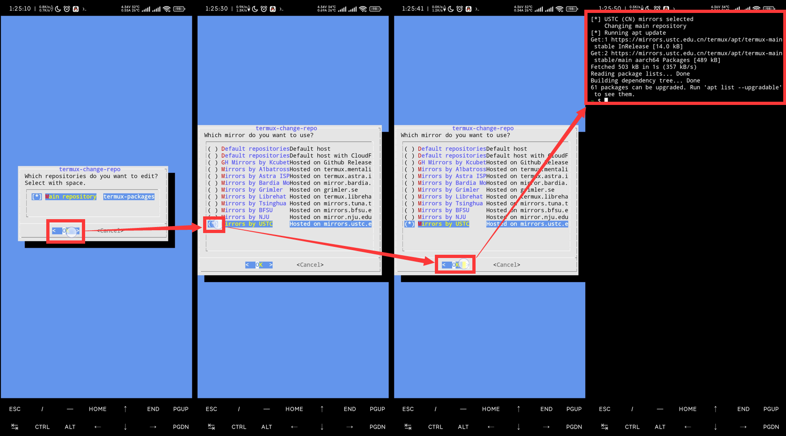

确认上一步完成后，输入`pkg update -y`。中间他会停下来几次问你要选择哪种操作，你每次都输入一个大写的Y就行。

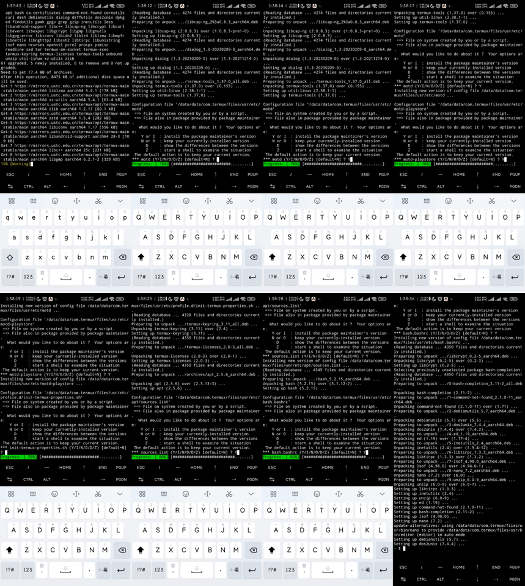


确认上一步完成后，输入`pkg install openssh -y`。最后输出以下内容就是安装openssh成功了。

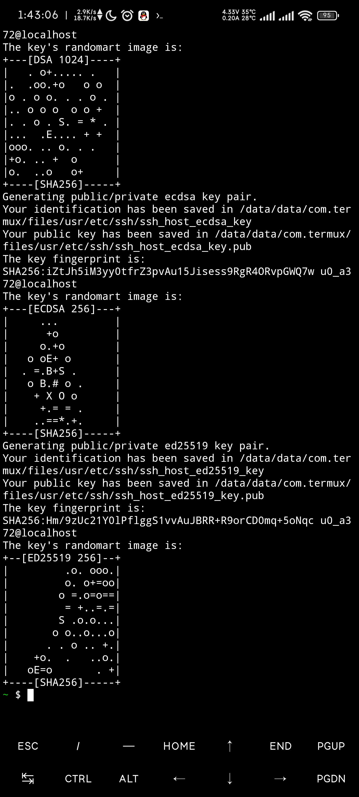

输入`passwd`配置密码，输入`sshd`启动openssh。

如果你完全不了解openssh，只是因为我写了就跟着操作的话，可以阅读[这篇文章](https://blog.csdn.net/qq_45740348/article/details/115602001)。

———————————分割线———————————

</details>

## 2.容器和脚本


<details><summary>脚本安装Arch以及管理脚本</summary>

进入Termux终端。输入

```
curl -LO gitee.com/TimeRainStarSky/TRSS-MTArch/raw/main/Install.sh && bash Install.sh
```

，稍作等待会显示如下页面，说明容器安装完毕。

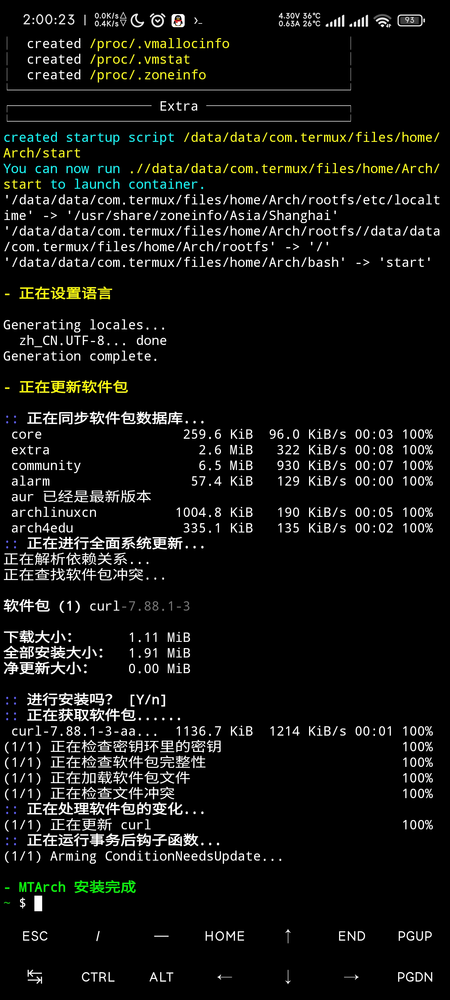

现在脚本做了更新，你安装后会默认启动脚本。

</details>

## 3.云崽本体

<details><summary>安装云崽</summary>

**如果你下面显示的内容跟我不完全一致，选择最接近的按钮即可。**

依次点击7 Le-Yunzai、确认、确认、回车。

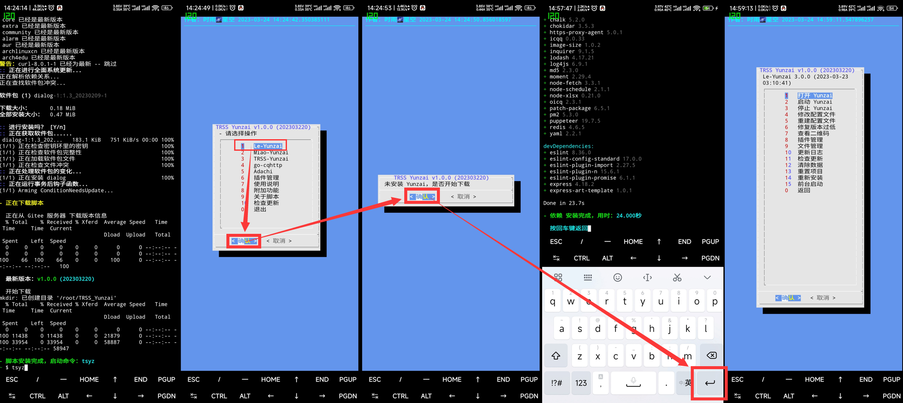

<details><summary>我想知道三个云崽都是干嘛的？</summary>

**[7.Le-Yunzai](../../../../TimeRainStarSky/Yunzai-Bot)** ：使用icqq协议，是原版云崽V3由各路大佬维护的版本，最推荐。脚本会安装时雨fork的版本。

**[8.Miao-Yunzai](../../../../yoimiya-kokomi/Miao-Yunzai)** ：使用icqq协议，由喵喵在原版云崽V3上进行了大改。

**[9.TRSS-Yunzai](../../../../TimeRainStarSky/Yunzai)** ：使用go-cqhttp协议，由时雨在原版云崽V3上进行了大改。

如果不想折腾，建议选第一个Le-Yunzai就行，我这篇教程也是这么做的。其他版本可能会导致部分插件出现问题。

如果愿意折腾可以玩第二个或者第三个。玩的话请先阅读对应的项目页！

其他都是别的BOT了，你折腾好云崽想玩可以自己去玩。

———————————分割线———————————

</details>

极少数情况会发生依赖安装失败，这时根据脚本提示再次安装即可。至此，云崽本体被成功安装。

接下来退出脚本。如果你懒得点直接杀termux后台也可以，再启动即可。

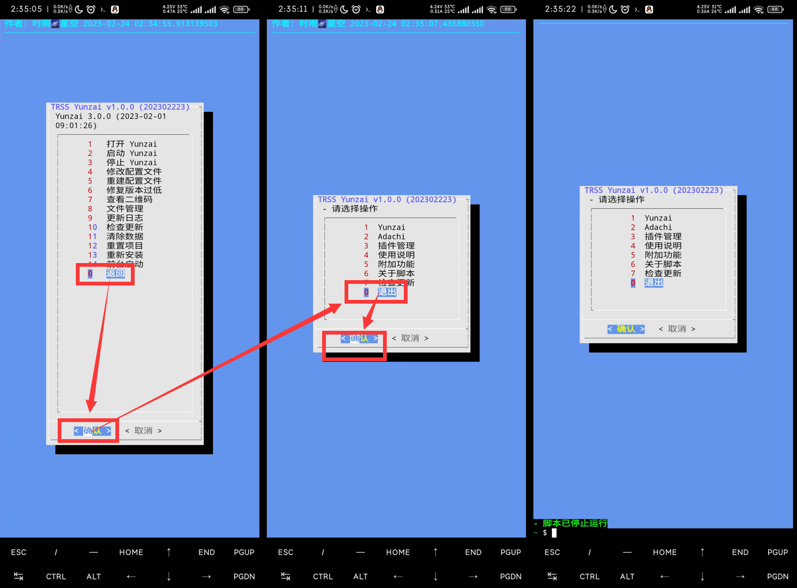

———————————分割线———————————

</details>


<details><summary>云崽换源</summary>

 **如果你是使用时雨脚本安装，则不需要执行此步。**

 **如果你完全跟着教程步骤安装，则不需要执行此步。**

(这是因为时雨脚本目前已经换源好[合适的云崽](../../../../TimeRainStarSky/Yunzai-Bot)了)

由于乐神云崽似乎暂时停更了，我们手动换喵喵的云崽已获取大佬的维护。进入Termux终端。输入`start`进入容器。

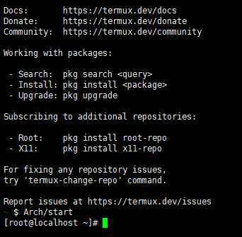


进入容器后输入`cd TRSS_Yunzai/Yunzai/`进入到云崽根目录，再输入

```
git remote set-url origin https://gitee.com/yoimiya-kokomi/Yunzai-Bot.git
```

即可完成换源。可以输入

```
git remote -v
```

做最后确认，输出和我完全一致就是成功了。

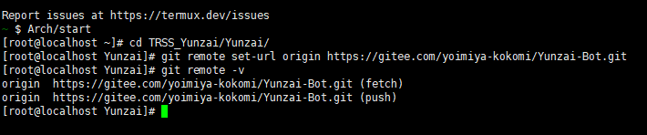

按下 ctrl + d 即可退出容器

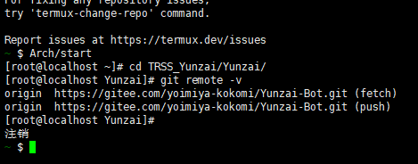

———————————分割线———————————

</details>


<details><summary>启动云崽</summary>

进入Termux终端。输入`tsab y f`即可启动云崽。首次启动请根据提示配置你的bot账密，登录方式建议iPad。


<details><summary>然后根据通过滑动验证。如果实在不会就点击展开</summary>

以下是推荐的方法，根据个人情况打开对应部分。

<details><summary>不便使用电脑，但是有vbn</summary>

首先根据提示下载[滑动验证app，点击此处下载，密码3kuu](https://wwp.lanzouy.com/i6w3J08um92h)。

**备用下载方案：**[QQ群文件](http://jq.qq.com/?_wv=1027&k=tqiOtCVc) [gitee下载](https://gitee.com/CUZNIL/Yunzai-install/raw/master/download/apks/滑动验证app.apk) [github下载](https://github.com/CUZNIL/Yunzai-install/raw/master/download/apks/滑动验证app.apk) [GHProxy下载](https://ghproxy.com/https://raw.githubusercontent.com/CUZNIL/Yunzai-install/master/download/apks/滑动验证app.apk) 

有vbn的话事情就简单很多了，打开你的vbn，然后回到termux，选择2.滑动验证app请求码获取。

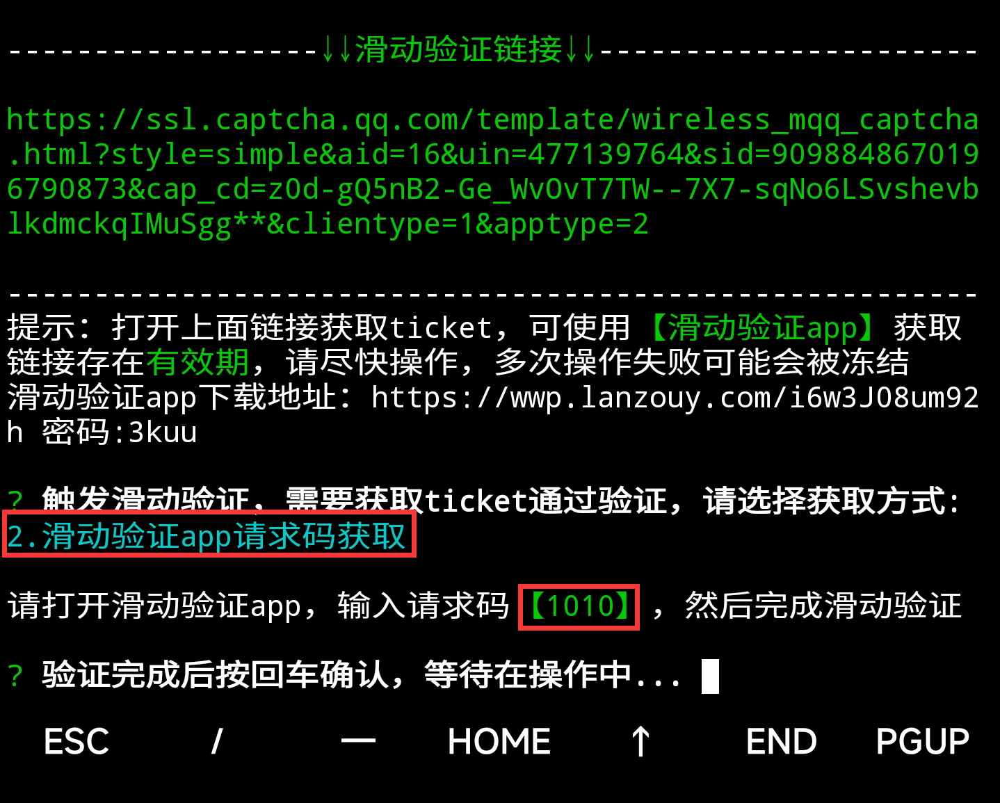

如图所示，我们会获得一个请求码，我获取的是1010。

打开滑动验证app，输入你获得的请求码。我获得的是1010所以我就输入了1010。输入后点击下一步，通过滑动验证即可。

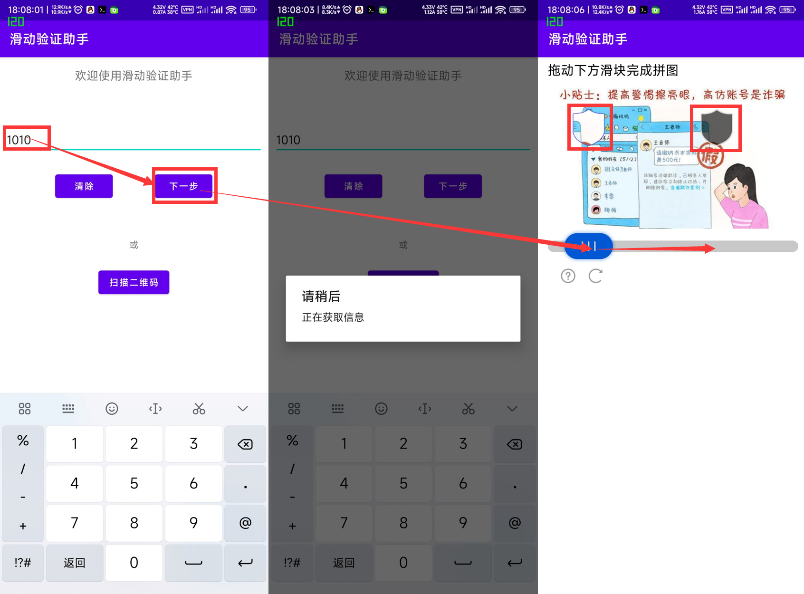

如果app让你滑动多次，属于正常现象，按要求操作即可。

通过后根据提示回到termux，敲下回车即可。

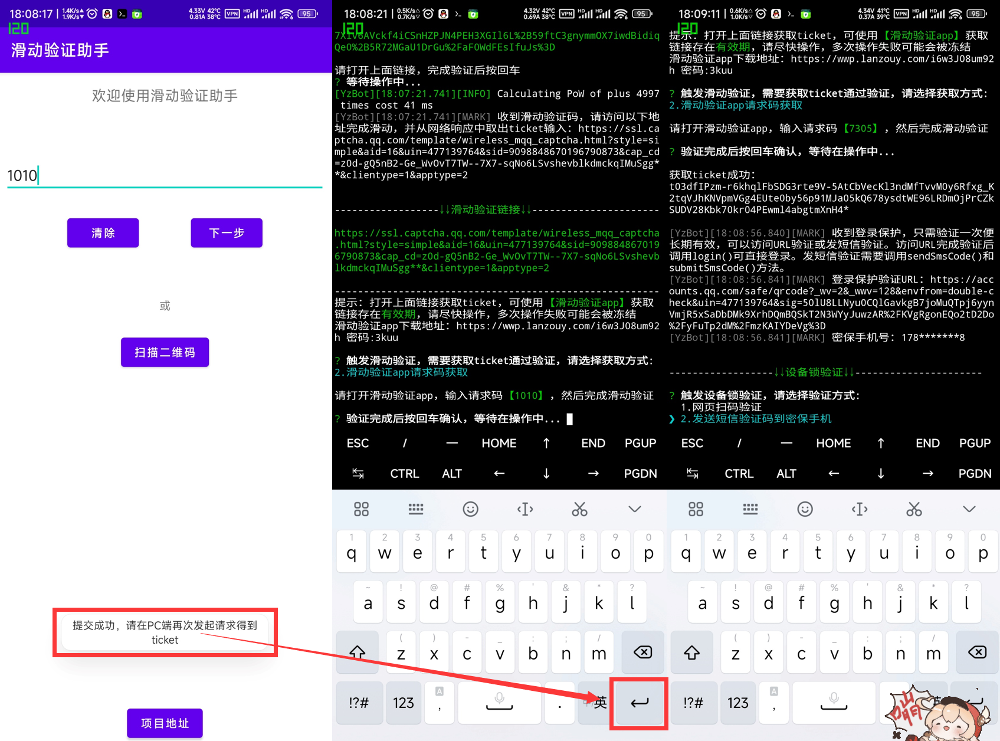

通过滑动验证后可以关闭你的vbn了，暂时用不到了。

———————————分割线———————————

</details>

<details><summary>不便使用电脑，并且没有vbn</summary>

首先根据提示下载[滑动验证app，点击此处下载，密码3kuu](https://wwp.lanzouy.com/i6w3J08um92h)。

**备用下载方案：**[QQ群文件](http://jq.qq.com/?_wv=1027&k=tqiOtCVc) [gitee下载](https://gitee.com/CUZNIL/Yunzai-install/raw/master/download/apks/滑动验证app.apk) [github下载](https://github.com/CUZNIL/Yunzai-install/raw/master/download/apks/滑动验证app.apk) [GHProxy下载](https://ghproxy.com/https://raw.githubusercontent.com/CUZNIL/Yunzai-install/master/download/apks/滑动验证app.apk) 

回到termux。如图，长按链接部分，选择复制。

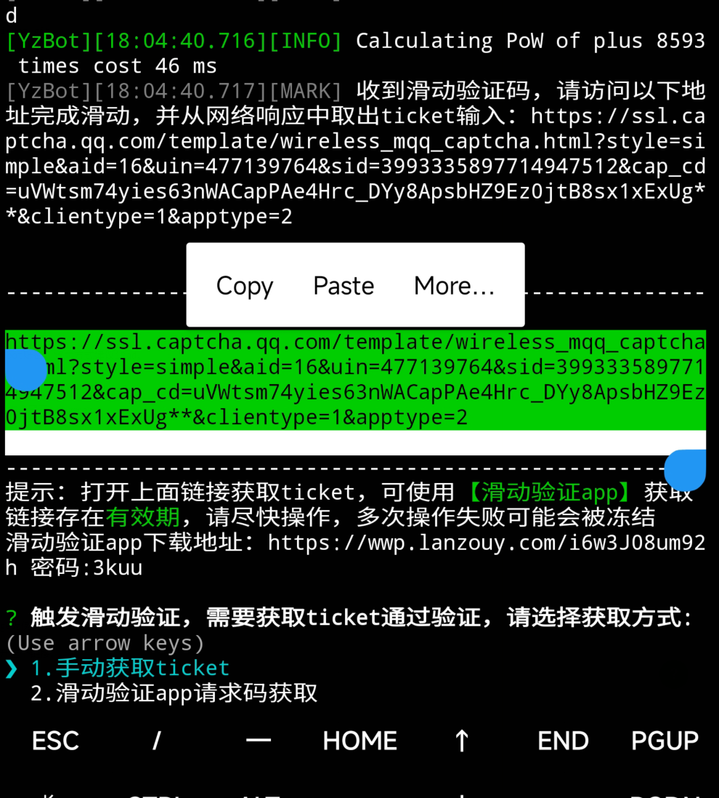

打开滑动验证app，输入你复制的链接。点击下一步，通过滑动验证。

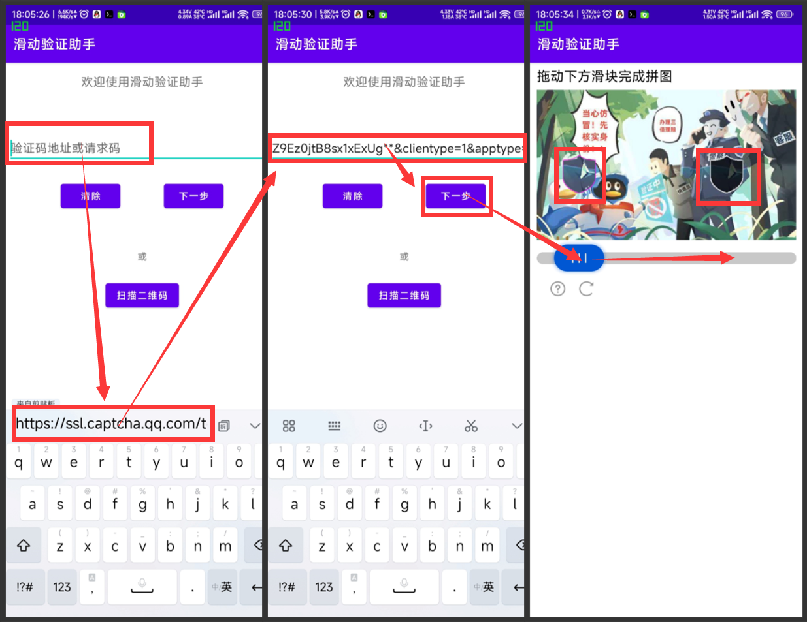

如果app让你滑动多次，属于正常现象，按要求操作即可。

通过后根据提示回到termux，将复制的ticket粘贴过来即可。

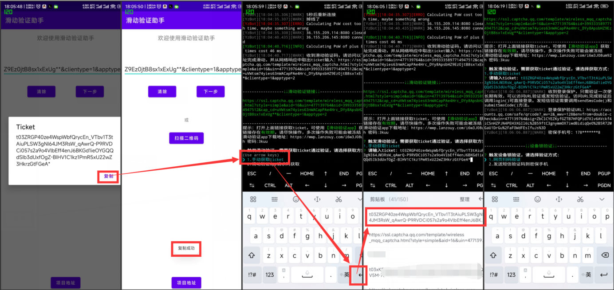

至此你已经通过了滑动验证，可以继续下一步了。

———————————分割线———————————

</details>


<details><summary>方便使用电脑</summary>

下面演示如何使用一般浏览器都有的开发工具来获取ticket，以win10平台的edge为例。

如图，长按链接部分，将他转发到电脑上用浏览器打开。


按键盘上的F12，调出开发工具，选择网络。

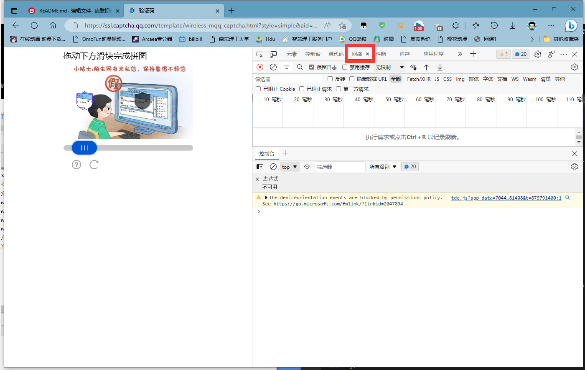

<details><summary>如果没有看到网络请展开这栏</summary>

如图所示，网络有可能默认隐藏，点击加号展开即可。

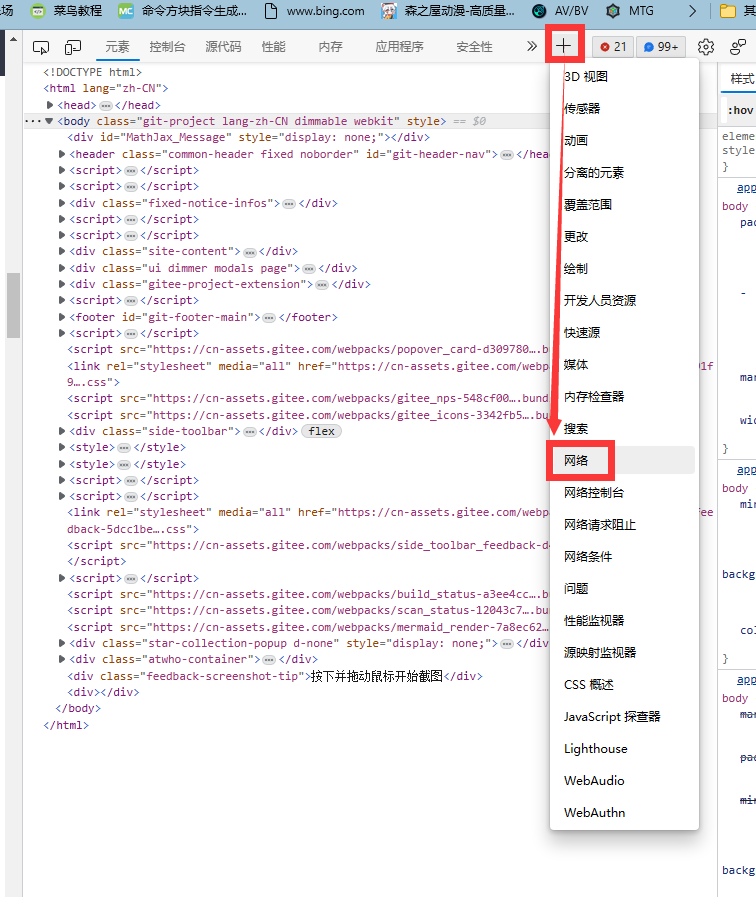


———————————分割线———————————

</details>


如果下面这张图里的红框内是黑色按钮，说明没有在记录网络日志。点一下让他变红，这样就能记录网络日志了。

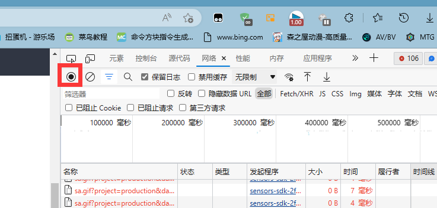

为了避免过多我们不需要的日志干扰，点击下图内红框中的清除标志来清除当前日志。

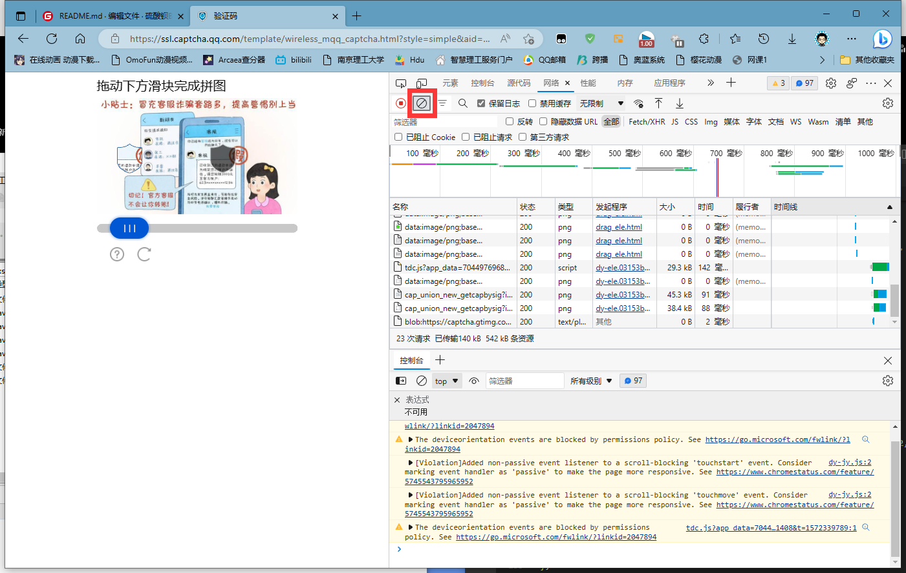

接下来拉动滑块通过验证即可，证明你不是机器人。

如果滑了一次以后没告诉你失败，而是又弹了一个滑块验证让你通过，则需要点击清除标志来清除当前日志，再通过滑块验证。

重复上面步骤直到画面空白，说明已经你完成了滑动验证。ticket就在如图所示的红框内。

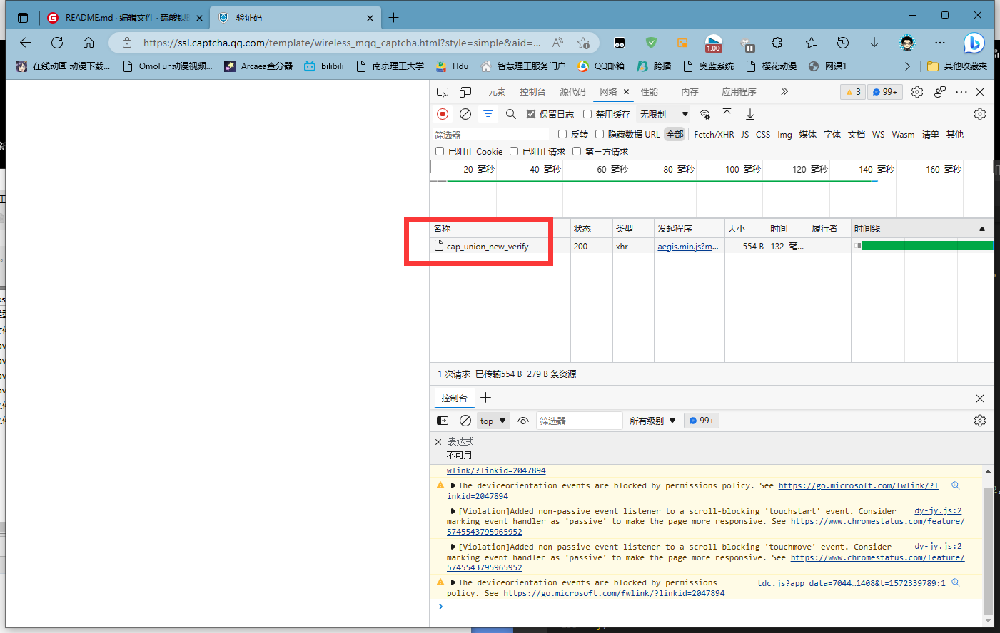

点击后会展开具体内容，接下来在ticket上右键，选择复制值即可。


接下来将这串内容传到手机上，选择1.手动获取ticket，然后输入即可。

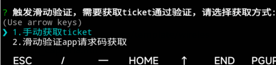

———————————分割线———————————

</details>


———————————分割线———————————

</details>

在你通过滑动验证后大概率会迎来你的搭建过程中第一个需要处理的报错，他有可能是图中的禁止登录，也有可能是版本过低。如果你很幸运地没有遇到报错，那么根据提示即可顺利让云崽登录你的机器人账号，接下来可以进入第四步挑选插件了，后续如果出现此报错再来处理。

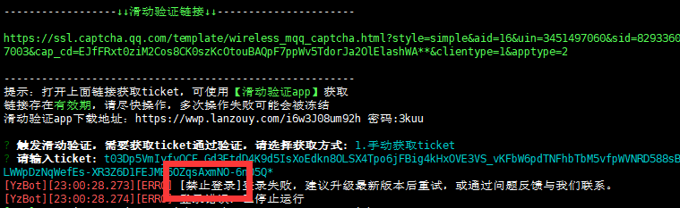

因为可能有俩种报错，你根据你实际显示的报错选择下面的处理方案即可，报错以上面图片中红框内内容为准。

按俩次 ctrl + c ，再根据提示操作退出脚本。

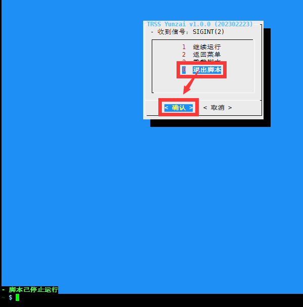


<details><summary>报错：版本过低</summary>

首先贴一张别人做的图，接下来的操作大概就是这个原理。不用跟这个图，管理脚本会处理好。


进入Termux终端。输入`tsab y`进入脚本的云崽管理界面。依次选择修复版本过低→iPad→BOT的账号。

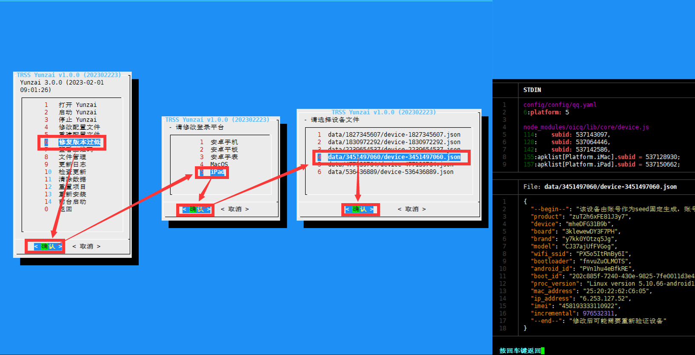

如果脚本工作正常，你现在可以按下 ctrl + c ，再根据提示操作退出脚本。输入`tsab y f`即可启动云崽，通过滑动验证即可顺利登录！

如果还是报错版本过低或者报错禁止登录，则尝试切换设备为MacOS，其他操作和上面一致。

还不行就继续往下看“报错：禁止登录”

———————————分割线———————————

</details>

<details><summary>报错：禁止登录</summary>

要解决这个报错，如果你会使用openssh在电脑使用xftp编辑文件会方便很多。这里为了方便讲述还是使用手机操作。

进入Termux终端。输入`tsab y file`进入脚本的文件管理页面。使用Termux底部的上下左右进入文件夹/node_modules/icqq/lib/core/，编辑文件device.js。

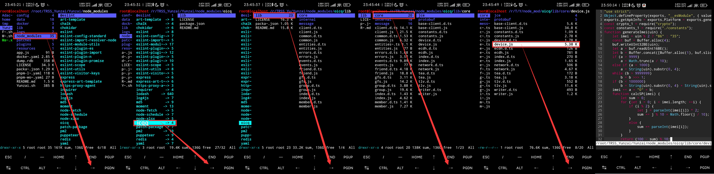

向下滑动直到你能看到最后一行。这时你能看到有一行的等号前面是[Platform.iPad].subid（注意是iPad！），等号后面会跟一串数字（可能和我截图的不一样）。

无论等号后的数字是多少，把他手动改成537128930，如图左边是改动前右边是改动后。按下ctrl+s保存该文件，按下ctrl+q退出文本编辑，按下q退出脚本的文件管理。

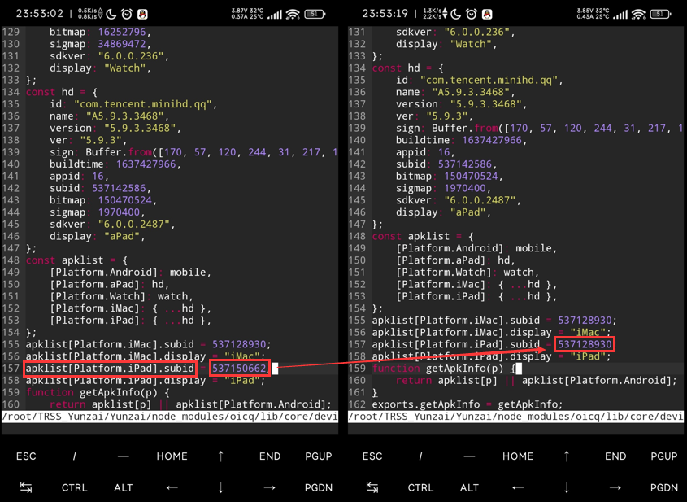

输入`tsab y f`即可启动云崽，通过滑动验证即可顺利登录！

如果无法正常登录请再次执行上面“报错：版本过低”的方案后再次执行“报错：禁止登录”的方案，目前挺多人用了这套组合拳下来都能解决。

 **4月14日更新：请参考目录结构手动修改[这个文件](download/TRSS_AllBot/Yunzai/node_modules/.pnpm/icqq@0.2.0/node_modules/icqq/lib/core/device.js)。** 

但是如果你还是报错的话，为了教程的完善，首先请再次仔细阅读本教程以保证你没有出现错误操作，然后通过这篇文章结尾的[QQ群](http://jq.qq.com/?_wv=1027&k=tqiOtCVc)联系我，请带着能证明你已经正确尝试过上面方案的截图，并尽量清晰地表述你遇到的问题。在向我反馈后，可以尝试[这个文档](https://www.wolai.com/oA43vuW71aBnv7UsEysn4T)的[这个方案](https://www.wolai.com/x1VcGp5ZRfAABr4JKtmuQx)，这是群友给我发的，我还没有尝试过有效性。

———————————分割线———————————

</details>

至此你已经顺利完成了云崽的搭建并且已经可以正常使用了。为了使用体验下面我做一些插件的推荐。

———————————分割线———————————

</details>

## 4.无脑推荐安装的Git插件

脚本还是挺好懂的，所以这边默认你们都能使用管理脚本完成插件的安装。如果担心操作失误或者真的不会可以展开下面。

<details><summary>使用脚本安装或卸载插件</summary>

本教程提到的所有插件该脚本都能在不碰键盘的情况下完成安装，所以不用担心。

进入Termux终端。输入`tsab`，依次选择Le-Yunzai、插件管理、Git 插件管理、安装插件

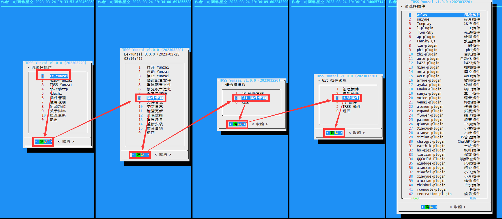

在这个页面选择你想安装的插件即可。以windoge风歌插件为例，直接点击35号插件，部分插件比如风歌没有gitee所以会让你选择github镜像源，有vbn或者能直连github的话建议选GitHub否则选GHProxy，一路确认即可，脚本会处理好几乎所有依赖。

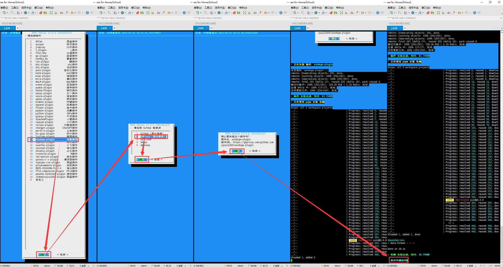

如果你想要安装.js插件，在Git 插件管理的安装插件处选择安装30号插件xitian-plugin戏天插件即可。

<details><summary>安装脚本没有的插件</summary>

举个例子，我想要安装[vits_yunzai_plugin](https://gitee.com/sumght/vits_yunzai_plugin)，但是云崽管理脚本没有这个插件。

进入脚本→Le-Yunzai→插件管理→Git 插件管理→安装插件，然后选择自定义，输入插件名(这个随便写，最好是和项目名一致)，输入插件URL(项目地址，直接从网页复制)，确认，稍等片刻即可安装成功。

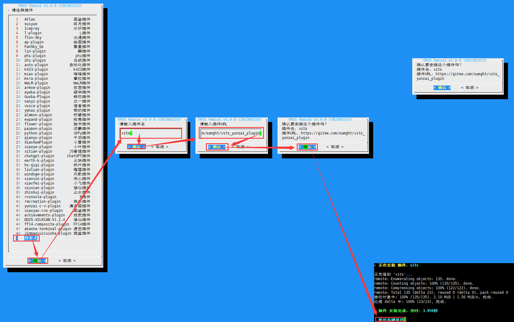

但是安装自定义插件时可能会出现安装不完全的情况，需要自行阅读插件的README确认。比如我们可以看到[vits_yunzai_plugin](https://gitee.com/sumght/vits_yunzai_plugin#%E5%AE%89%E8%A3%85%E6%95%99%E7%A8%8B)的安装并没有止步于此，还需要配置权重文件等，下面这张图里红框的部分我们都没有完成。脚本未适配的插件需要你手动折腾，碰到问题先自己搜索尝试解决，不行再有礼貌地带着清晰的问题找人问。

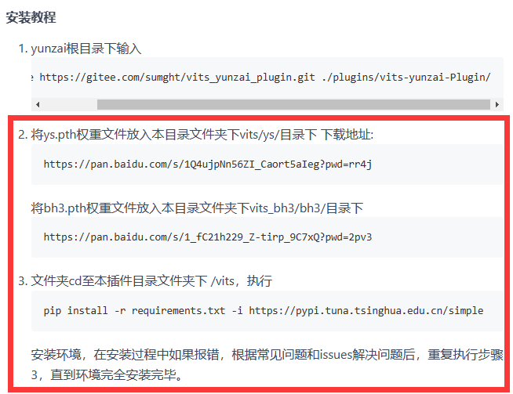

———————————分割线———————————

</details>


<details><summary>使用脚本卸载插件</summary>

在Termux终端输入`tsab`，进入云崽管理脚本。依次选择Le-Yunzai→插件管理→Git 插件管理→管理插件→你要卸载的插件(图中我们卸载armoe插件)→删除插件→最后确认，然后稍等一俩秒就卸载干净了。

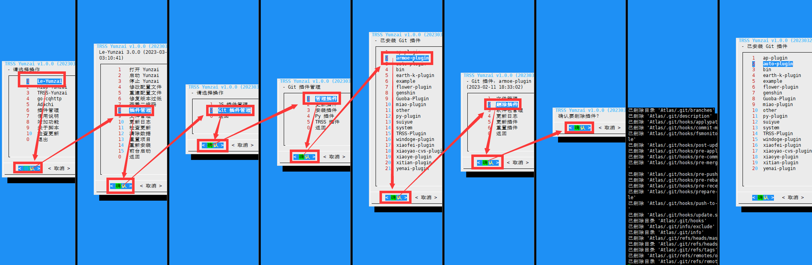

———————————分割线———————————

</details>

———————————分割线———————————

</details>

下面我推荐三个建议所有人安装的插件：

| 序号 | Git项目名                                                       | 中文名         | 简述                                           |
|----|--------------------------------------------------------------|-------------|----------------------------------------------|
| 13 | [miao-plugin](../../../../yoimiya-kokomi/miao-plugin)        | 喵喵插件        | 角色面板查询(enka、米游社)、国内数据库查询(胡桃数据库)              |
| 18 | [Guoba-Plugin](../../../../guoba-yunzai/guoba-plugin)        | 锅巴插件        | 提供后台管理界面、配置机器人的基础设置以及原神相关设置、可视化自定义编辑喵喵帮助     |
| 44 | [xiaoyao-cvs-plugin](../../../../Ctrlcvs/xiaoyao-cvs-plugin) | 图鉴插件(注意有重名) | 扫码登录绑定ck/sk、大量图鉴信息查询、stoken绑定、更新抽卡记录、米游社全部签到 |

<details><summary>点击查看脚本中这些插件的对应位置</summary>

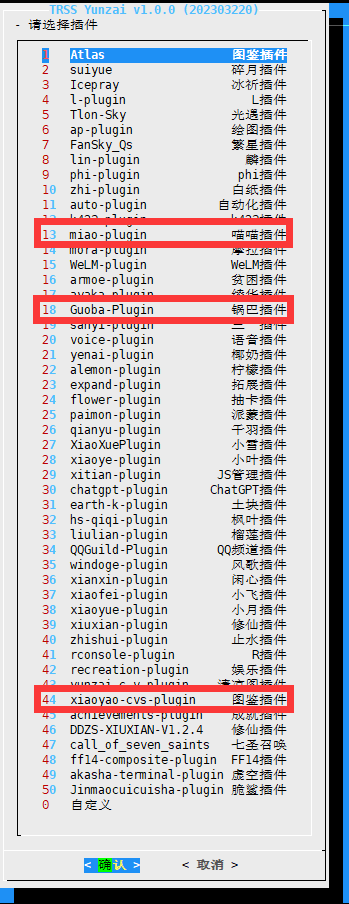

</details>

这些插件的后续配置脚本是完全处理好了的，所以你们按照脚本操作安装即可，我不做过多说明。

如果插件安装使用过程中还有问题请先点击项目名进入对应项目地址，查看有无处理方案。有就用，没有就百度必应啥的搜一下。有的话就用，确认没有的话再礼貌地找人问该怎么解决。

## 5.我安装的Git插件

除了上面推荐的三个插件，以下是我安装的其他Git插件。

| 序号 | Git项目名                                                       | 中文名   | 简述                             |
|----|--------------------------------------------------------------|-------|--------------------------------|
| 单独 | [TRSS-Plugin](../../../../TimeRainStarSky/TRSS-Plugin)       | 时雨插件  | 本地语音合成，远程命令，文件操作等              |
| 6  | [ap-plugin](../../../../yhArcadia/ap-plugin)                 | 绘图插件  | AI绘图、抠图、二次元的我等                 |
| 11 | [auto-plugin](../../../../Nwflower/auto-plugin)              | 自动化插件 | 提供各式各样的定时任务功能和自动监听功能           |
| 31 | [earth-k-plugin](../../../../SmallK111407/earth-k-plugin)    | 土块插件  | 大量娱乐功能如emoji合成、全角色语音、chatgpt等  |
| 24 | [flower-plugin](../../../../Nwflower/flower-plugin)          | 抽卡插件  | 提供百连、三十连等操作以免用户抽卡刷屏            |
| 单独 | [py-plugin](../../../../realhuhu/py-plugin)                  | Py插件  | 内置NoneBot，可装队伍伤害计算、表情包制作、幻影坦克等 |
| 2  | [suiyue](http://gitee.com/Acceleratorsky/suiyue)             | 碎月插件  | 查各地疫情，今日关键词，加减乘除计算器            |
| 35 | [windoge-plugin](http://github.com/gxy12345/windoge-plugin)  | 风歌插件  | xx参考面板，未复刻角色/武器，素材汇总图          |
| 37 | [xiaofei-plugin](../../../../xfdown/xiaofei-plugin)          | 小飞插件  | 消息风控处理，高清语音点歌，查各地天气，原神注册时间     |
| 29 | [xitian-plugin](../../../../XiTianGame/xitian-plugin)        | 戏天插件  | 便捷管理js插件                       |
| 21 | [yenai-plugin](../../../../yeyang52/yenai-plugin)            | 椰奶插件  | 角色收益曲线，群管理，消息监听等。提供对马甲的一些便捷操作  |
| 28 | [xiaoye-plugin](https://gitee.com/xiaoye12123/xiaoye-plugin) | 小叶插件  | 模拟刷圣遗物和强化,可自定义概率               |

上面表格中带数字序号的插件你们按需安装即可，步骤参考“使用脚本安装或卸载插件”，部分插件会出现一些脚本暂时没有解决的问题我一会再单独介绍。

如果你还想获取其他插件，除了时雨脚本已经适配好的整整50个插件，还可以看看渔火整理的[**Yunzai-Bot 插件索引**](../../../../yhArcadia/Yunzai-Bot-plugins-index)。

下面稍微提一下时雨插件和Py插件的安装使用，你们按需点开即可。

<details><summary>时雨插件</summary>

如果不开vbn直接用脚本安装可能会出现下图的情况导致安装失败。

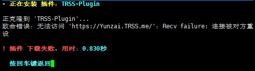

下面分为你没有vbn和有vbn俩种情况进行安装的教学，根据自己情况点开。

<details><summary>没有vbn安装插件本体</summary>

请先尝试点击[这个网页](https://trss.me/)，如果能在不手动刷新的情况下一次就正常显示如下页面，恭喜你网络不错，你可以直接使用下面有vbn的步骤但是不用打开vbn，现在可以收起这个栏目。

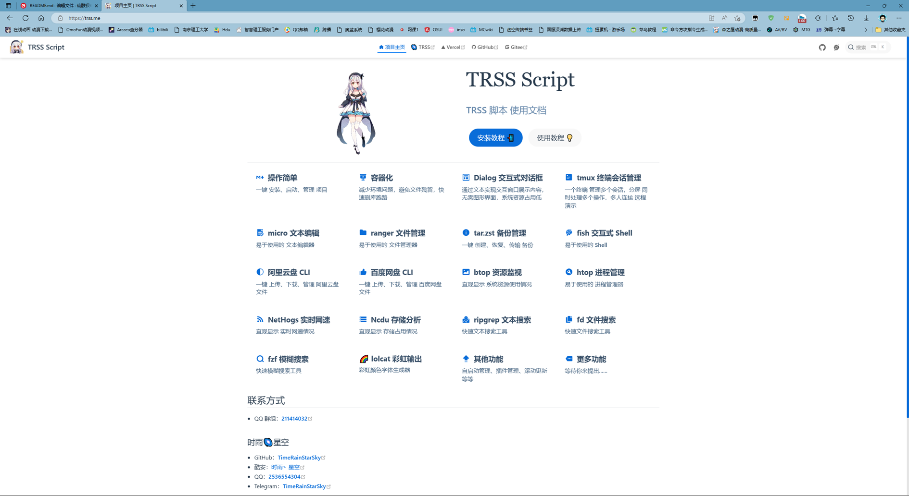

从脚本默认的入口无法安装插件本体，就是因为你无法访问那个网站。时雨可能是出于后续方便维护的考虑做了重定向，但是你网络不好是没法访问的。不过我们只要手动安装即可，毕竟插件的项目地址本身是gitee，国内应该都可以访问。

进入Termux终端，输入`tsab`进入云崽管理脚本。依次选择插件管理、Git插件管理、安装插件、自定义，然后输入TRSS-Plugin，输入

```
https://gitee.com/TimeRainStarSky/TRSS-Plugin/
```

，最后点击确认即可。

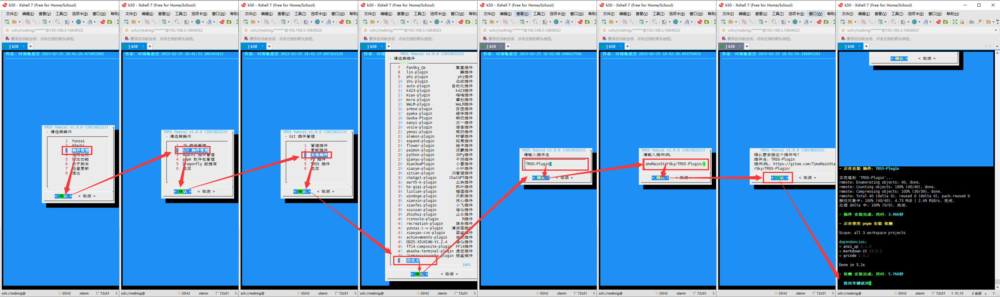

显示插件依赖顺利安装成功，则可以进行下一步的插件配置。

———————————分割线———————————

</details>

<details><summary>有vbn安装插件本体</summary>

第一步当然是打开你的vbn，这个不便过多描述，为了过审我甚至一直故意打错字。

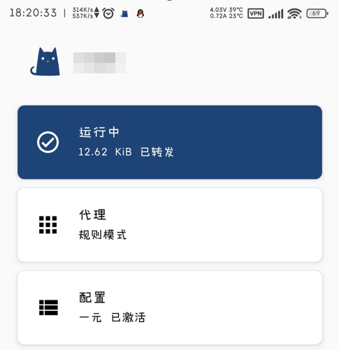

接下来就很简单了，使用脚本完成插件本体的安装即可。

进入Termux终端，输入`tsab`进入云崽管理脚本。依次选择插件管理、Git插件管理、TRSS插件、确认即可。

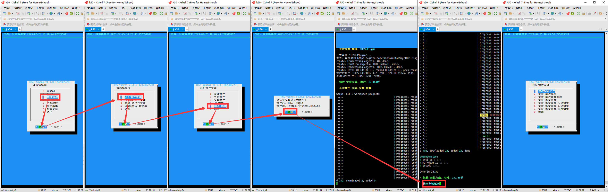

显示插件依赖顺利安装成功，则可以进行下一步的插件配置。到这里你可以关闭你的vbn了。

———————————分割线———————————

</details>

至此你已经完成了插件本体的安装，接下来进行具体的配置。

<details><summary>插件配置</summary>


进入Termux终端，输入`tsab`进入云崽管理脚本。依次选择插件管理、Git插件管理、TRSS插件。

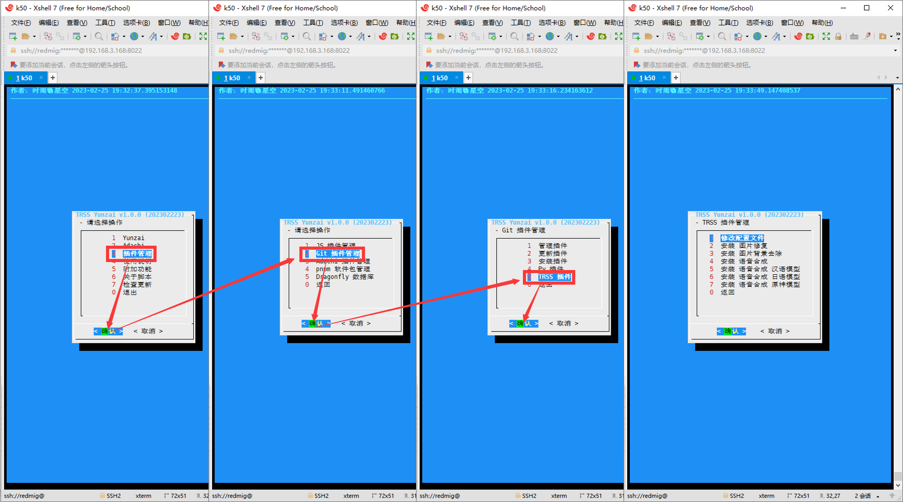

在这个页面根据你的需要安装对应内容即可，脚本全处理好了。比如你需要本地合成原神角色音色，你就安装语音合成和语音合成 原神模型就可以了。

完成你需要的所有安装以后请注意，该插件的语音合成默认用接口但是目前接口失效了，所有必须手动更改配置文件。首先我们退出脚本，然后输入`tsab y f`启动云崽，在成功登录进去以后再按ctrl+c退出。输入`tsab`进入云崽管理脚本。依次选择插件管理、Git插件管理、TRSS插件、修改配置文件。

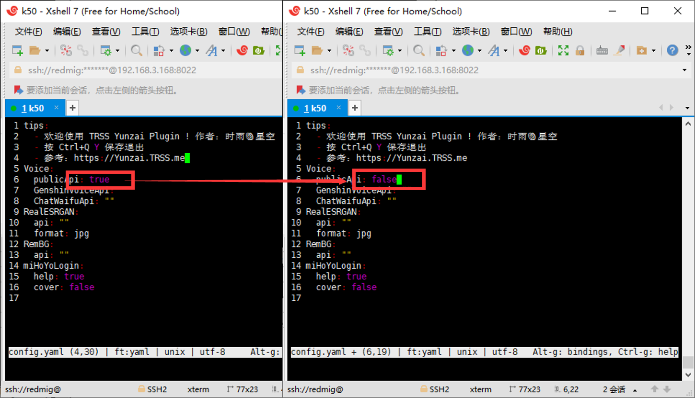

如图所示，将publicApi对应的值由默认的true改为false，按ctrl+s保存本次更改，按ctrl+q退出本次编辑。

———————————分割线———————————

</details>


 **至此彻底完成时雨插件的安装和配置。** 

———————————分割线———————————

</details>


<details><summary>Py插件</summary>

这边默认你会安装配置本插件，只做nonebot插件推荐。 **如果你不知道请展开下一行。** 


<details><summary>我不知道如何安装配置该插件</summary>

首先是安装说明：

进入Termux终端，输入`tsab`进入云崽管理脚本。依次选择插件管理、Git插件管理、Py插件、确认即可。


正常会显示依赖安装成功，如果失败根据提示重装直到依赖安装成功即可。

如果不报错的话不需要后续配置。重新启动云崽，注意Python服务器是否正常启动。如果正常启动你的日志会长这个样子，会出现红框内一模一样的内容。请重点确认是否出现


```
[YzBot][20:15:38.541][MARK] python服务器启动成功
[YzBot][20:15:38.550][INFO] py服务器连接成功
```

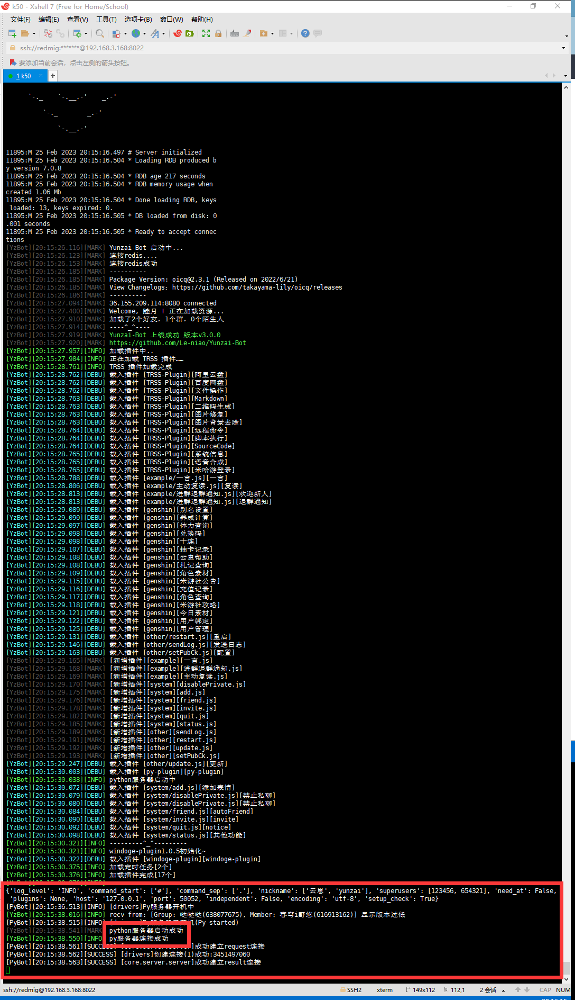


私聊BOT或者群聊发送`py帮助`即可获取该插件的常用操作列表。


安装插件只需要发送`py下载插件+nonebot插件名称`即可。

首先挑选我们喜欢的nonebot插件，如图可以从[nonebot商店](https://v2.nonebot.dev/store)获取插件的完整名称，如果点不进去可以尝试[这个链接](https://nb2.baka.icu/store)。下面以安装[头像表情包](https://github.com/noneplugin/nonebot-plugin-petpet)为例。

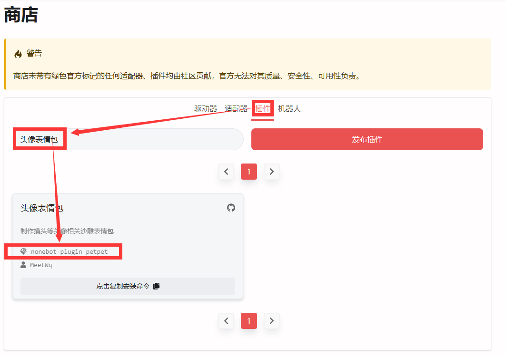

从这里我们确认到我们需要的这个插件的完整名称是`nonebot_plugin_petpet`，所以我们在聊天界面向BOT发送消息`py下载插件nonebot_plugin_petpet`，稍等片刻即可安装完毕。

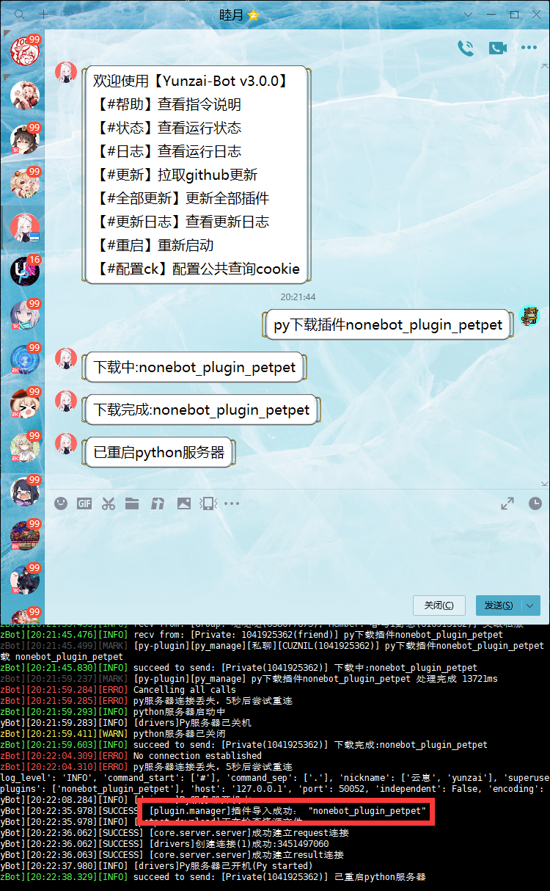

确认到如图内容， **说明该插件已经正确安装。** 

———————————分割线———————————

</details>

下面是我个人安装的一些nonebot插件。

| nonebot插件名称               | 中文名称                                                                | 大概功能                     |
|---------------------------|---------------------------------------------------------------------|--------------------------|
| nonebot-plugin-gspanel    | [原神角色展柜查询](https://github.com/monsterxcn/nonebot-plugin-gspanel)    | 根据角色展柜中的数据计算队伍伤害。        |
| nonebot-plugin-bawiki     | [BAWiki](https://github.com/lgc2333/nonebot-plugin-bawiki/)         | 碧蓝档案日程表、学生图鉴、角色语音、模拟抽卡等。 |
| nonebot_plugin_oddtext    | [文本生成器](https://github.com/noneplugin/nonebot-plugin-oddtext)       | 抽象话、火星文等文本生成。            |
| nonebot_plugin_abbrreply  | [缩写查询器](https://github.com/anlen123/nonebot_plugin_abbrreply)       | 查看缩写可能的解释。               |
| nonebot_plugin_miragetank | [幻影坦克图片合成](https://github.com/RafuiiChan/nonebot_plugin_miragetank) | 幻影坦克合成和分解。               |
| nonebot-plugin-memes      | [表情包制作](https://github.com/noneplugin/nonebot-plugin-memes)         | 表情包制作。                   |
| nonebot_plugin_PicMenu    | [可视化菜单](https://github.com/hamo-reid/nonebot_plugin_PicMenu)        | 以图片方式呈现功能菜单。             |
| nonebot_plugin_emojimix   | [emoji合成](https://github.com/noneplugin/nonebot-plugin-emojimix)    | emoji 合成器。               |

针对上面这些插件中部分可能遇到问题的插件我单独做说明，要装哪个插件就只打开哪个栏目。

<details><summary>原神角色展柜查询</summary>

请仔细阅读[该插件作者对py插件用户的说明](https://github.com/monsterxcn/nonebot-plugin-gspanel/issues/17)。考虑到可能有人无法访问github，下面是页面截图。请仔细确认，我觉得作者说的很详细了所以不做更多说明。


根据插件作者的说明配置好即可，比如这是[我的配置](download/TRSS_AllBot/Yunzai/plugins/py-plugin/config.yaml)：

```
...（以上省略）
# nonebot-plugin-gspanel 配置项
gspanel_alias:
  - nb面板
gspanel_scale: 1
resources_mirror: https://enka.network/ui/
resources_dir: /root/TRSS_AllBot/Yunzai/plugins/py-plugin/data
...（以下省略）
```

———————————分割线———————————

</details>

<details><summary>BAWiki</summary>

想正常使用本插件大部分功能很有必要搞一个vbn。那如果你没有，我也不方便教你。

但如果你已经安装，你依旧可以选择卸载该插件。如图发送`py卸载插件nonebot-plugin-bawiki`即可。

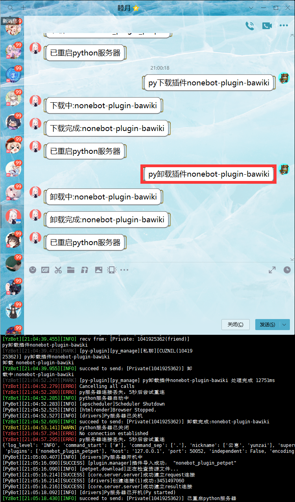


———————————分割线———————————

</details>

<details><summary>表情包制作插件口口口</summary>

具体报错情况如下图，发送“#头像表情包”会出现大量的 口口口，即缺字体。

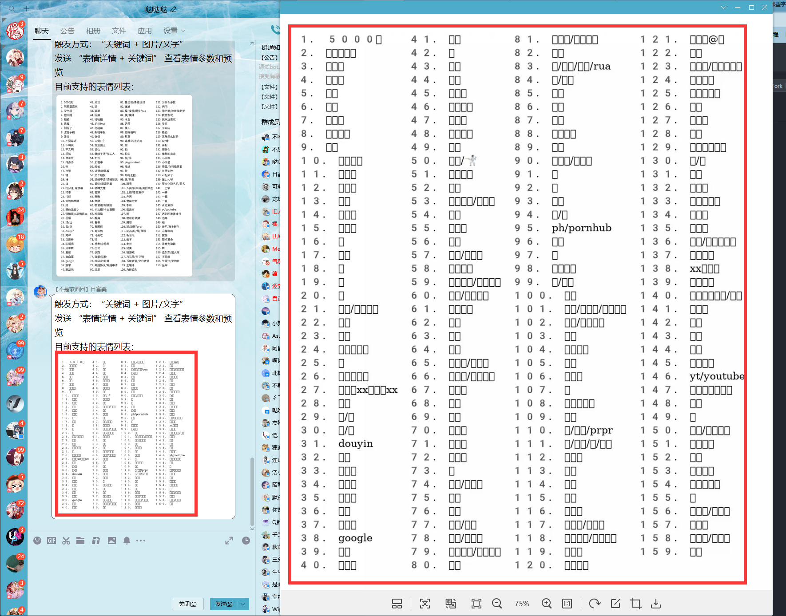

首先安装[时雨插件](../../../../TimeRainStarSky/TRSS-Plugin/)以便直接通过QQ操作。不愿意安装的话在合适路径参考下面命令执行是相同效果。

向机器人输入下面这行命令，检查时雨插件和表情包制作插件是否下载好。

```
rcp ls plugins/py-plugin/data/fonts/
```

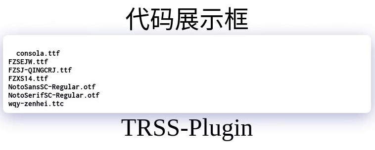

如图所示确认到有NotoSansSC-Regular.otf，说明字体资源下载好了。接下来为所有用户安装。如果没有请启动你的机器人，稍等一会他会自动下载表情包制作需要的所有资源（当然包括字体）。等待下载完毕再开始向后执行。

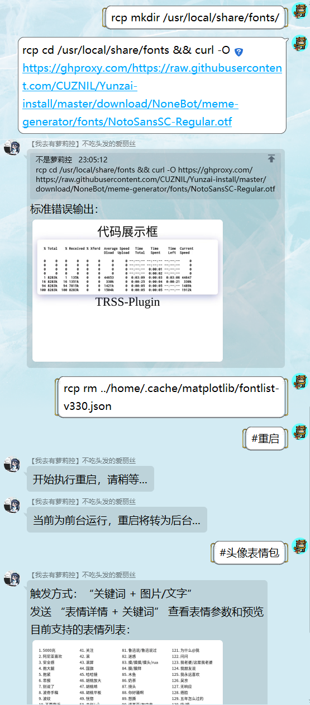

如图所示，向机器人依次发送下面三条消息。

```
rcp mkdir /usr/local/share/fonts/
```
```
rcp cd /usr/local/share/fonts && curl -O https://ghproxy.com/https://raw.githubusercontent.com/CUZNIL/Yunzai-install/master/download/TRSS_AllBot/Yunzai/plugins/py-plugin/data/fonts/NotoSansSC-Regular.otf
```
下载快的话五六秒，慢的话一俩分钟。下载后出现如图所示的“标准错误输出”是正常现象。
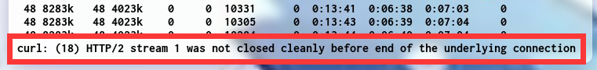

但是如果标准错误输出的结尾包含类似上图的红框内容，请重新下载，再次输入刚才的命令直到“标准错误输出”中没有出现上图的红框内容。

↓确认没有问题继续。↓
```
rcp rm ../home/.cache/matplotlib/fontlist-v330.json
```
```
rcp rm ../home/.cache/nonebot2/nonebot_plugin_memes/*
```
最后重启机器人即可正常使用。比如你可以向机器人发消息“#重启”。

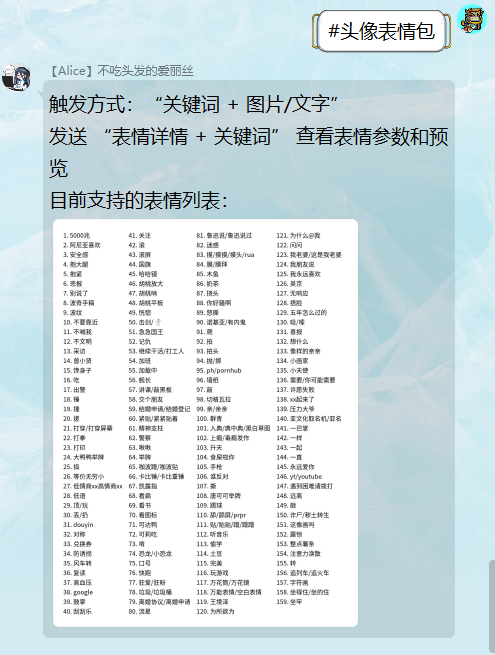

———————————分割线———————————

</details>

———————————分割线———————————

</details>

以下俩个上面提到的插件使用脚本安装大概率会出现一些问题，故单独说明，也是你需要安装再点开即可。

<details><summary>附加说明：绘图插件 ap-plugin</summary>

[点此前往绘图插件项目地址](https://gitee.com/yhArcadia/ap-plugin#%E9%85%8D%E7%BD%AE%E6%8E%A5%E5%8F%A3)，作者写的挺清楚的，对于他的README能解决的问题我不会再次说明。下面讲解一下手机环境可能遇到的问题：

<details><summary>怎么安装额外需要的依赖？</summary>

脚本正常工作的情况下，插件必要的依赖会在插件安装时就安装好。

但是有部分依赖并不是必备，而是实现插件一部分功能需要的，这部分脚本可能不会为你安装好，需要你手动安装。

下面讲解我们该怎么安装这些额外需要的依赖。

比如绘图插件提示我们在使用图片审核前需要安装baidu-aip-sdk这个依赖。那么我们以这个做为例子直接使用脚本安装。

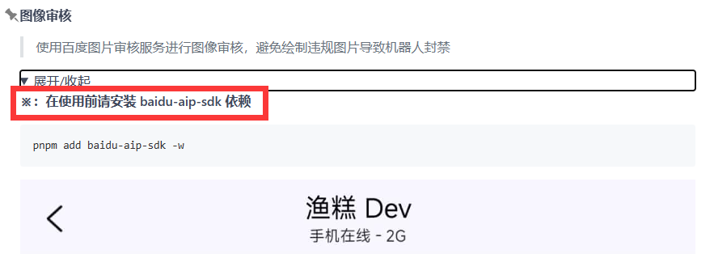

进入Termux终端，输入`tsab p g`以进入Git插件管理页面。接下来依次选择管理插件、你缺依赖的插件(这里是ap-plugin)、软件包管理、安装软件包，然后输入你缺的依赖名称(这里是baidu-aip-sdk)即可。下图展示了一次成功安装依赖的过程。

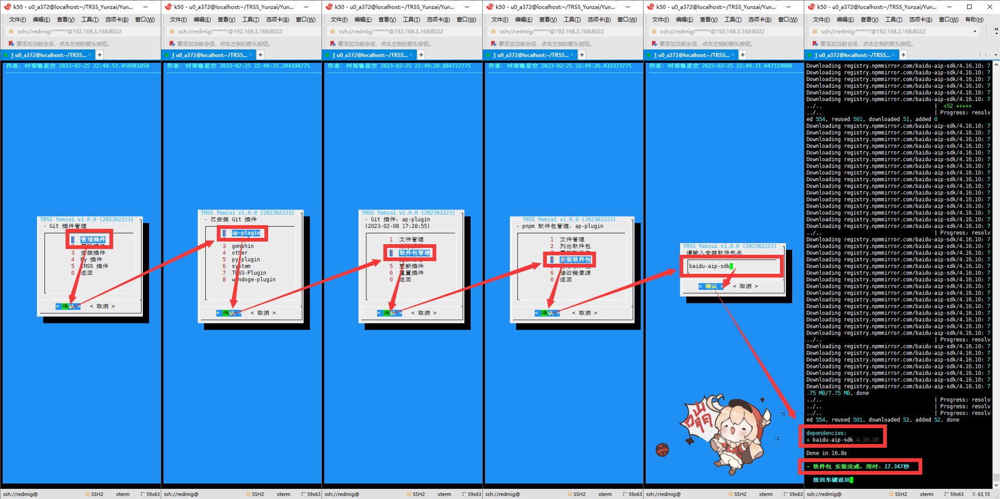

如果安装失败，可以重试几次。一直不行则继续往后阅读，本教程涉及的插件的所有依赖问题都有解决方案。

———————————分割线———————————

</details>

<details><summary>canvas依赖安装失败</summary>

如果你的报错长下面这个样子，则继续往下看，否则大概率是网络问题，请先重试几次。


仔细阅读报错信息，可以看到其实已经说明安装失败的原因。

```
 /bin/sh:行1: pkg-config：未找到命令
```

未找到命令说明缺依赖了，我们需要去手动安装pkg-config这个依赖，再回来安装canvas就可以了。具体步骤如下：

首先进入Termux终端，输入下面这行指令以进入Arch容器。


```
start
```

接下来手动安装需要的依赖即可，输入下面这行指令。

```
pacman -Sy --noconfirm pkg-config node-gyp gcc make
```

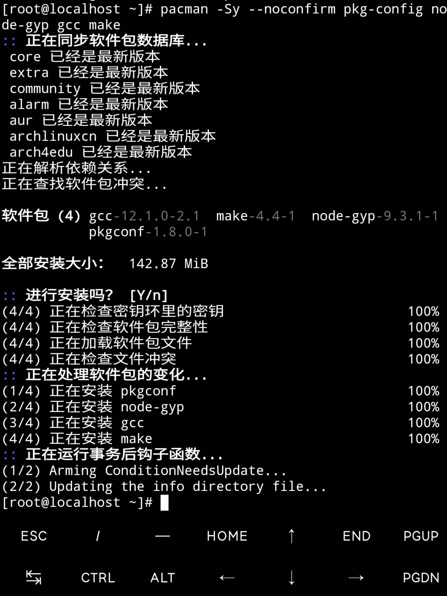

如图显示则依赖安装成功，我们现在回到管理脚本安装canvas依赖即可。

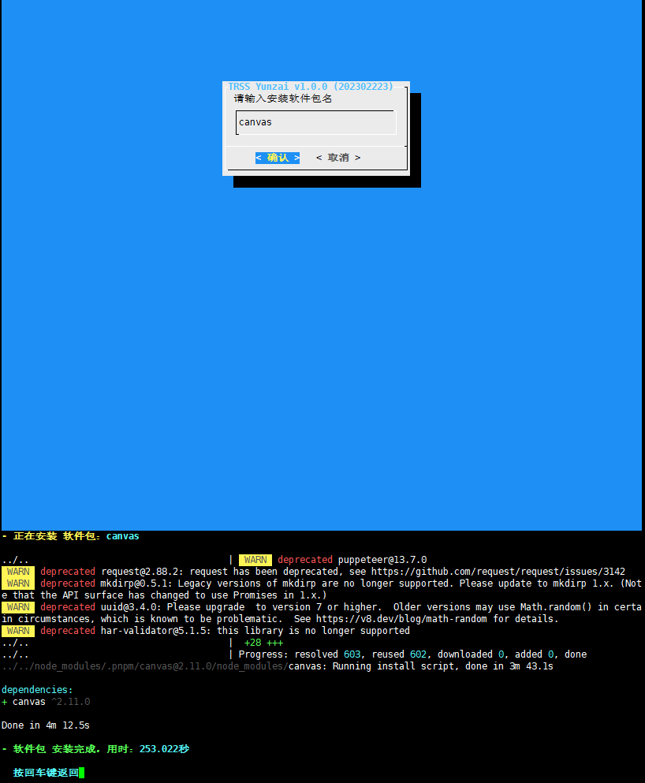

如图显示依赖安装成功。

———————————分割线———————————

</details>


———————————分割线———————————

</details>

<details><summary>附加说明：碎月插件 suiyue</summary>


<details><summary>怎么安装额外需要的依赖？</summary>

脚本正常工作的情况下，插件必要的依赖会在插件安装时就安装好。

但是有部分依赖并不是必备，而是实现插件一部分功能需要的，这部分脚本可能不会为你安装好，需要你手动安装。

下面讲解我们该怎么安装这些额外需要的依赖。

比如绘图插件提示我们在使用图片审核前需要安装baidu-aip-sdk这个依赖。那么我们以这个做为例子直接使用脚本安装。


进入Termux终端，输入`tsab p g`以进入Git插件管理页面。接下来依次选择管理插件、你缺依赖的插件(这里是ap-plugin)、软件包管理、安装软件包，然后输入你缺的依赖名称(这里是baidu-aip-sdk)即可。下图展示了一次成功安装依赖的过程。


如果安装失败，可以重试几次。一直不行则继续往后阅读，本教程涉及的插件的所有依赖问题都有解决方案。

———————————分割线———————————

</details>


<details><summary>nodejieba依赖安装失败</summary>

缺依赖了，我们需要去手动安装一些依赖，再回来安装nodejieba就可以了。具体步骤如下：

首先进入Termux终端，输入下面这行指令以进入Arch容器。


```
start
```

接下来手动安装需要的依赖即可，输入下面这行指令。

```
pacman -Sy --noconfirm pkg-config node-gyp gcc make
```


如图显示则依赖安装成功，我们现在回到管理脚本安装nodejieba依赖即可。

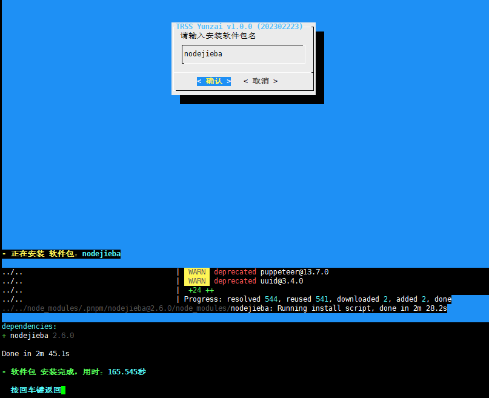

如图显示依赖安装成功。

———————————分割线———————————

</details>


———————————分割线———————————

</details>

如果你认真看完了本篇教程，应该能解决你在搭建云崽过程中的所有疑问了。

但是如果插件安装使用过程中还有问题，请先点击项目名进入对应项目地址，查看有无处理方案。有就用，没有就百度必应啥的搜一下。有的话就用，确认没有的话再礼貌地找人问该怎么解决。

## 6.我安装的js插件
| js插件名称                                                                                                          | 大概功能                                                                                                                      |
|-----------------------------------------------------------------------------------------------------------------|---------------------------------------------------------------------------------------------------------------------------|
| [账号管理](../../../Yunzai-QQmanager)                                                                               | 当前马甲被封禁时自动切换其他马甲                                                                                                          |
| [给头衔](../../../Yunzai-giveTitle)                                                                                | 让群友可以自己领想要的专属头衔。                                                                                                          |
| [面板通用化](../../../Yunzai-MiaoToGspanel)                                                                          | 将[喵喵插件](../../../../yoimiya-kokomi/miao-plugin)产生的面板数据适配到[Gspanel](https://github.com/monsterxcn/nonebot-plugin-gspanel)。 |
| [redis数据库备份](download/TRSS_AllBot/Yunzai/plugins/example/redis%E6%95%B0%E6%8D%AE%E5%BA%93%E5%A4%87%E4%BB%BD.js) | 备份redis中的QQ-uid                                                                                                           |
| [定时重启](download/TRSS_AllBot/Yunzai/plugins/example/%E5%AE%9A%E6%97%B6%E9%87%8D%E5%90%AF.js)                     | 指定一个时间重启bot                                                                                                               |
| [查委托](https://gitee.com/mofengdada/chaweituo)                                                                   | 查询指定委托有无成就，如果有会概述如何获取                                                                                                     |
| [谁艾特我](https://gitee.com/Saury-loser/Saury)                                                                     | 快速定位谁在几百年前@了你，降血压必备                                                                                                       |
| [更换节点](https://gitee.com/ThreeYi/sy_js_plugin#1%E6%9B%B4%E6%8D%A2%E8%8A%82%E7%82%B9)                            | 更换喵喵插件使用的enka节点                                                                                                           |
| 域名是否被拦截                                                                                                         | 判断给定网站能否访问                                                                                                                |
| 优质睡眠                                                                                                            | 将想要睡觉的群友禁言到明早八点                                                                                                           |
| [真实评分](https://github.com/ldcivan/true_ranking_plugin)                                                          | 通过获取b站番剧长短评计算实际的评分数据                                                                                                      |
| 恶臭计算器                                                                                                           | 论证任何数字都是臭的(生成114514计算式)                                                                                                   |
| 查询qq权重                                                                                                          | 查询QQ好的权重，越低越容易被封                                                                                                          |

作者已经发布到github/gitee的插件均有超链接，点击即可获取。

如果你还想获取其他插件，还可以看看渔火整理的[**Yunzai-Bot 插件索引**](../../../../yhArcadia/Yunzai-Bot-plugins-index)。

## 7.部分报错处理整合

以下报错或处理都在前文合适的位置出现过了，放在这里是为了方便查阅，如已仔细阅读前文则不必再看。

<details><summary>云崽换源</summary>

 **如果你是使用时雨脚本安装，则不需要执行此步。**

 **如果你完全跟着教程步骤安装，则不需要执行此步。**

(这是因为时雨脚本目前已经换源好[合适的云崽](../../../../TimeRainStarSky/Yunzai-Bot)了)

由于乐神云崽似乎暂时停更了，我们手动换喵喵的云崽已获取大佬的维护。进入Termux终端。输入`start`进入容器。


进入容器后输入`cd TRSS_Yunzai/Yunzai/`进入到云崽根目录，再输入

```
git remote set-url origin https://gitee.com/yoimiya-kokomi/Yunzai-Bot.git
```

即可完成换源。可以输入

```
git remote -v
```

做最后确认，输出和我完全一致就是成功了。


按下 ctrl + d 即可退出容器


———————————分割线———————————

</details>

<details><summary>如何通过滑动验证</summary>

以下是推荐的方法，根据个人情况打开对应部分。

<details><summary>不便使用电脑，但是有vbn</summary>

首先根据提示下载[滑动验证app，点击此处下载，密码3kuu](https://wwp.lanzouy.com/i6w3J08um92h)。

**备用下载方案：**[QQ群文件](http://jq.qq.com/?_wv=1027&k=tqiOtCVc) [gitee下载](https://gitee.com/CUZNIL/Yunzai-install/raw/master/download/apks/滑动验证app.apk) [github下载](https://github.com/CUZNIL/Yunzai-install/raw/master/download/apks/滑动验证app.apk) [GHProxy下载](https://ghproxy.com/https://raw.githubusercontent.com/CUZNIL/Yunzai-install/master/download/apks/滑动验证app.apk) 

有vbn的话事情就简单很多了，打开你的vbn，然后回到termux，选择2.滑动验证app请求码获取。


如图所示，我们会获得一个请求码，我获取的是1010。

打开滑动验证app，输入你获得的请求码。我获得的是1010所以我就输入了1010。输入后点击下一步，通过滑动验证即可。


如果app让你滑动多次，属于正常现象，按要求操作即可。

通过后根据提示回到termux，敲下回车即可。


通过滑动验证后可以关闭你的vbn了，暂时用不到了。

———————————分割线———————————

</details>

<details><summary>不便使用电脑，并且没有vbn</summary>

首先根据提示下载[滑动验证app，点击此处下载，密码3kuu](https://wwp.lanzouy.com/i6w3J08um92h)。

**备用下载方案：**[QQ群文件](http://jq.qq.com/?_wv=1027&k=tqiOtCVc) [gitee下载](https://gitee.com/CUZNIL/Yunzai-install/raw/master/download/apks/滑动验证app.apk) [github下载](https://github.com/CUZNIL/Yunzai-install/raw/master/download/apks/滑动验证app.apk) [GHProxy下载](https://ghproxy.com/https://raw.githubusercontent.com/CUZNIL/Yunzai-install/master/download/apks/滑动验证app.apk) 

回到termux。如图，长按链接部分，选择复制。


打开滑动验证app，输入你复制的链接。点击下一步，通过滑动验证。


如果app让你滑动多次，属于正常现象，按要求操作即可。

通过后根据提示回到termux，将复制的ticket粘贴过来即可。


———————————分割线———————————

</details>


<details><summary>方便使用电脑</summary>

下面演示如何使用一般浏览器都有的开发工具来获取ticket，以win10平台的edge为例。

如图，长按链接部分，将他转发到电脑上用浏览器打开。


按键盘上的F12，调出开发工具，选择网络。


<details><summary>如果没有看到网络请展开这栏</summary>

如图所示，网络有可能默认隐藏，点击加号展开即可。


———————————分割线———————————

</details>


如果下面这张图里的红框内是黑色按钮，说明没有在记录网络日志。点一下让他变红，这样就能记录网络日志了。


为了避免过多我们不需要的日志干扰，点击下图内红框中的清除标志来清除当前日志。


接下来拉动滑块通过验证即可，证明你不是机器人。

如果滑了一次以后没告诉你失败，而是又弹了一个滑块验证让你通过，则需要点击清除标志来清除当前日志，再通过滑块验证。

重复上面步骤直到画面空白，说明已经你完成了滑动验证。ticket就在如图所示的红框内。


点击后会展开具体内容，接下来在ticket上右键，选择复制值即可。


接下来将这串内容传到手机上，选择1.手动获取ticket，然后输入即可。


———————————分割线———————————

</details>

———————————分割线———————————

</details>

<details><summary>报错：版本过低</summary>

首先贴一张别人做的图，接下来的操作大概就是这个原理。不用跟这个图，管理脚本会处理好。


进入Termux终端。输入`tsab y`进入脚本的云崽管理界面。依次选择修复版本过低→iPad→BOT的账号。


如果脚本工作正常，你现在可以按下 ctrl + c ，再根据提示操作退出脚本。输入`tsab y f`即可启动云崽，通过滑动验证即可顺利登录！

如果还是报错版本过低或者报错禁止登录，则尝试切换设备为MacOS，其他操作和上面一致。

还不行就继续往下看“报错：禁止登录”

———————————分割线———————————

</details>

<details><summary>报错：禁止登录</summary>

要解决这个报错，如果你会使用openssh在电脑使用xftp编辑文件会方便很多。这里为了方便讲述还是使用手机操作。

进入Termux终端。输入`tsab y file`进入脚本的文件管理页面。使用Termux底部的上下左右进入文件夹/node_modules/icqq/lib/core/，编辑文件device.js。


向下滑动直到你能看到最后一行。这时你能看到有一行的等号前面是[Platform.iPad].subid（注意是iPad！），等号后面会跟一串数字（可能和我截图的不一样）。

无论等号后的数字是多少，把他手动改成537128930，如图左边是改动前右边是改动后。按下ctrl+s保存该文件，按下ctrl+q退出文本编辑，按下q退出脚本的文件管理。


输入`tsab y f`即可启动云崽，通过滑动验证即可顺利登录！

如果无法正常登录请再次执行上面“报错：版本过低”的方案后再次执行“报错：禁止登录”的方案，目前挺多人用了这套组合拳下来都能解决。

 **4月14日更新：请参考目录结构手动修改[这个文件](download/TRSS_AllBot/Yunzai/node_modules/.pnpm/icqq@0.2.0/node_modules/icqq/lib/core/device.js)。** 

但是如果你还是报错的话，为了教程的完善，首先请再次仔细阅读本教程以保证你没有出现错误操作，然后通过这篇文章结尾的[QQ群](http://jq.qq.com/?_wv=1027&k=tqiOtCVc)联系我，请带着能证明你已经正确尝试过上面方案的截图，并尽量清晰地表述你遇到的问题。在向我反馈后，可以尝试[这个文档](https://www.wolai.com/oA43vuW71aBnv7UsEysn4T)的[这个方案](https://www.wolai.com/x1VcGp5ZRfAABr4JKtmuQx)，这是群友给我发的，我还没有尝试过有效性。

———————————分割线———————————

</details>


<details><summary>没有vbn安装时雨插件</summary>

请先尝试点击[这个网页](https://trss.me/)，如果能在不手动刷新的情况下一次就正常显示如下页面，恭喜你网络不错，你可以直接使用下面有vbn的步骤但是不用打开vbn，现在可以收起这个栏目。


从脚本默认的入口无法安装插件本体，就是因为你无法访问那个网站。时雨可能是出于后续方便维护的考虑做了重定向，但是你网络不好是没法访问的。不过我们只要手动安装即可，毕竟插件的项目地址本身是gitee，国内应该都可以访问。

进入Termux终端，输入`tsab`进入云崽管理脚本。依次选择插件管理、Git插件管理、安装插件、自定义，然后输入TRSS-Plugin，输入

```
https://gitee.com/TimeRainStarSky/TRSS-Plugin/
```

，最后点击确认即可。


显示插件依赖顺利安装成功，则可以进行下一步的插件配置。

———————————分割线———————————

</details>

<details><summary>有vbn安装时雨插件</summary>

第一步当然是打开你的vbn，这个不便过多描述，为了过审我甚至一直故意打错字。


接下来就很简单了，使用脚本完成插件本体的安装即可。

进入Termux终端，输入`tsab`进入云崽管理脚本。依次选择插件管理、Git插件管理、TRSS插件、确认即可。


显示插件依赖顺利安装成功，则可以进行下一步的插件配置。到这里你可以关闭你的vbn了。

———————————分割线———————————

</details>


<details><summary>时雨插件合成语音没反应</summary>

进入Termux终端，输入`tsab`进入云崽管理脚本。依次选择插件管理、Git插件管理、TRSS插件。


在这个页面根据你的需要安装对应内容即可，脚本全处理好了。比如你需要本地合成原神角色音色，你就安装语音合成和语音合成 原神模型就可以了。

完成你需要的所有安装以后请注意，该插件的语音合成默认用接口但是目前接口失效了，所有必须手动更改配置文件。首先我们退出脚本，然后输入`tsab y f`启动云崽，在成功登录进去以后再按ctrl+c退出。输入`tsab`进入云崽管理脚本。依次选择插件管理、Git插件管理、TRSS插件、修改配置文件。


如图所示，将publicApi对应的值由默认的true改为false，按ctrl+s保存本次更改，按ctrl+q退出本次编辑。

———————————分割线———————————

</details>

<details><summary>Nonebot插件：表情包制作口口口</summary>

具体报错情况如下图，发送“#头像表情包”会出现大量的 口口口，即缺字体。


首先安装[时雨插件](../../../../TimeRainStarSky/TRSS-Plugin/)以便直接通过QQ操作。不愿意安装的话在合适路径参考下面命令执行是相同效果。

向机器人输入下面这行命令，检查时雨插件和表情包制作插件是否下载好。

```
rcp ls plugins/py-plugin/data/fonts/
```


如图所示确认到有NotoSansSC-Regular.otf，说明字体资源下载好了。接下来为所有用户安装。如果没有请启动你的机器人，稍等一会他会自动下载表情包制作需要的所有资源（当然包括字体）。等待下载完毕再开始向后执行。


如图所示，向机器人依次发送下面三条消息。

```
rcp mkdir /usr/local/share/fonts/
```
```
rcp cd /usr/local/share/fonts && curl -O https://ghproxy.com/https://raw.githubusercontent.com/CUZNIL/Yunzai-install/master/download/TRSS_AllBot/Yunzai/plugins/py-plugin/data/fonts/NotoSansSC-Regular.otf
```

下载快的话五六秒，慢的话一俩分钟。下载后出现如图所示的“标准错误输出”是正常现象。


但是如果标准错误输出的结尾包含类似上图的红框内容，请重新下载，再次输入刚才的命令直到“标准错误输出”中没有出现上图的红框内容。

↓确认没有问题继续。↓
```
rcp rm ../home/.cache/matplotlib/fontlist-v330.json
```
```
rcp rm ../home/.cache/nonebot2/nonebot_plugin_memes/*
```
最后重启机器人即可正常使用。比如你可以向机器人发消息“#重启”。


———————————分割线———————————

</details>

<details><summary>绘图插件：canvas依赖安装失败</summary>

如果你的报错长下面这个样子，则继续往下看，否则大概率是网络问题，请先重试几次。


仔细阅读报错信息，可以看到其实已经说明安装失败的原因。

```
 /bin/sh:行1: pkg-config：未找到命令
```

未找到命令说明缺依赖了，我们需要去手动安装pkg-config这个依赖，再回来安装canvas就可以了。具体步骤如下：

首先进入Termux终端，输入下面这行指令以进入Arch容器。


```
start
```

接下来手动安装需要的依赖即可，输入下面这行指令。

```
pacman -Sy --noconfirm pkg-config node-gyp gcc make
```


如图显示则依赖安装成功，我们现在回到管理脚本安装canvas依赖即可。


如图显示依赖安装成功。

———————————分割线———————————

</details>

<details><summary>碎月插件：nodejieba依赖安装失败</summary>

缺依赖了，我们需要去手动安装一些依赖，再回来安装nodejieba就可以了。具体步骤如下：

首先进入Termux终端，输入下面这行指令以进入Arch容器。


```
start
```

接下来手动安装需要的依赖即可，输入下面这行指令。

```
pacman -Sy --noconfirm pkg-config node-gyp gcc make
```


如图显示则依赖安装成功，我们现在回到管理脚本安装nodejieba依赖即可。


如图显示依赖安装成功。

———————————分割线———————————

</details>

### **如需通过修改文件实现某些功能或修复某些问题，可以参考[这个链接](download/TRSS_AllBot)下的文件结构，暂时没空送佛送到西。** 

## 8.使用习惯建议

<details><summary>1.息屏挂机运行云崽</summary>

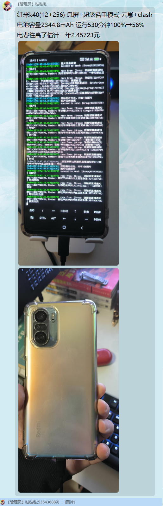

如图所示是我的BOT运行环境。出于省电的考虑建议开启你手机的超级省电模式，并在息屏状态下运行云崽。以下是具体步骤，以红米K40的MIUI13为例：

进入手机的控制中心（一般在通知栏附近），寻找超级省电按钮。如果没有，可能需要再编辑里找一找手动添加后再选择。

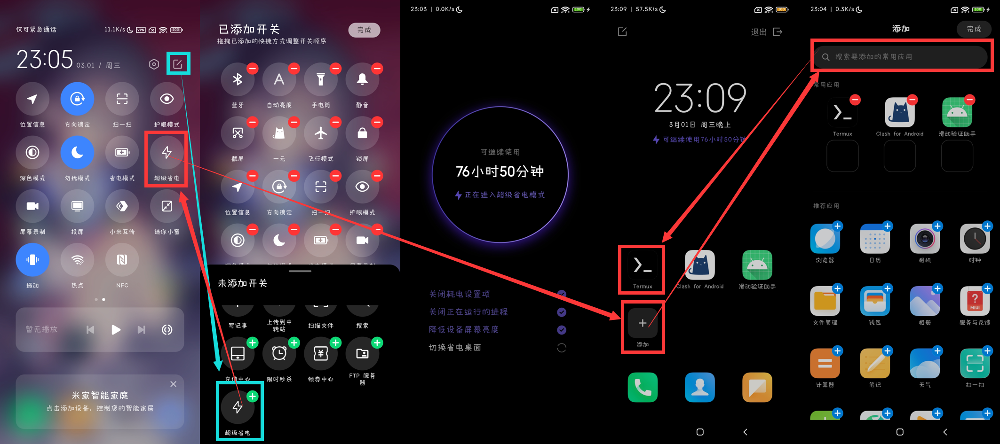

如图进入超级省电模式后，手动添加你运行机器人需要的APP，比如这里我加了Termux本体、vbn和滑动验证助手。如果没啥问题其实加个Termux就行。

进入Termux终端，输入下面这行指令以在息屏情况下持续地运行云崽。

```
termux-wake-lock && tsab y f
```

当然如果你有在使用openssh，也可以用这行指令。保证只用一行命令能方便下次启动时直接按"↑"回忆一行命令即可所以推荐全挤在一行。

```
sshd && termux-wake-lock && tsab y f
```

如果你是首次使用`termux-wake-lock`，可能会有需要你操作的地方，比如小米会跳转到这个页面，根据我们的需要那当然是从默认的智能限制改为无限制。

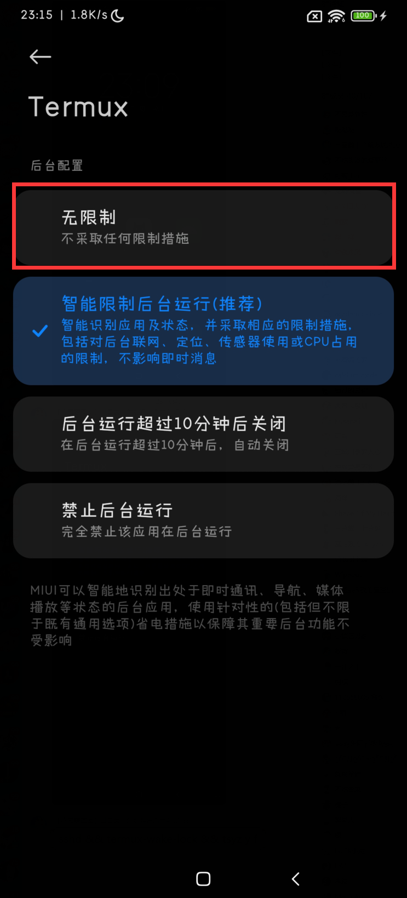

如此操作以后便可以放心息屏使用了，不出意外是云崽是不会突然停止的了。

<details><summary>下次如何便捷启动云崽？</summary>

首先需要让termux记住你输入过上面的指令，需要一次正常的退出进程。具体步骤如下：

首先正常输入一遍启动指令，比如我需要openssh我就用`sshd && termux-wake-lock && tsab y f`。

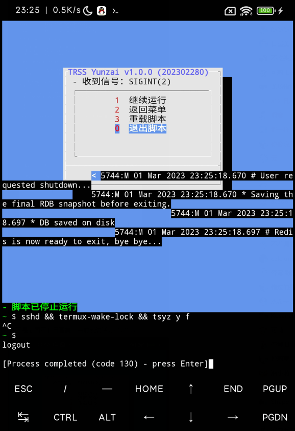

然后我们按下ctrl+c再根据提示退出脚本，最后按下ctrl+d即可进行一次正常的退出进程了。

这样termux就会记住我们上一次输入了这条指令，我们下次因各种原因重新打开termux时就可以按"↑"回忆这条命令，再按enter确认输入即可。

———————————分割线———————————

</details>

———————————分割线———————————

</details>

<details><summary>2.使用NMM便捷管理云崽文件</summary>

apk下载地址(任一)：[QQ群文件](http://jq.qq.com/?_wv=1027&k=tqiOtCVc) [天翼网盘(访问码：pui5)](https://cloud.189.cn/t/n2i6ZfJnUNRb) [gitee下载](https://gitee.com/CUZNIL/Yunzai-install/raw/master/download/apks/NMM(in.mfile.beta)_1.14.2-beta(200267).apk) [github下载](https://github.com/CUZNIL/Yunzai-install/raw/master/download/apks/NMM(in.mfile.beta)_1.14.2-beta(200267).apk) [GHProxy下载](https://ghproxy.com/https://raw.githubusercontent.com/CUZNIL/Yunzai-install/master/download/apks/NMM(in.mfile.beta)_1.14.2-beta(200267).apk) 

下载后安装到手机。

<details><summary>如果手机已经root点此处。</summary>

如果手机已经root，可以直接访问`/data/data/com.termux/files/home`，这里就是termux的目录。

再进入`/Arch/rootfs/root`，这里就是Arch容器的目录。

最后再进入`/TRSS_Yunzai/Yunzai`，这里就是云崽本体的根目录。

———————————分割线———————————

</details>

下面介绍你没有root的处理方式。首先请 **确保Termux没有被后台杀掉，然后打开NMM** 。以一加ace2的ColorOS 13为例演示如何通过NMM访问Termux文件。

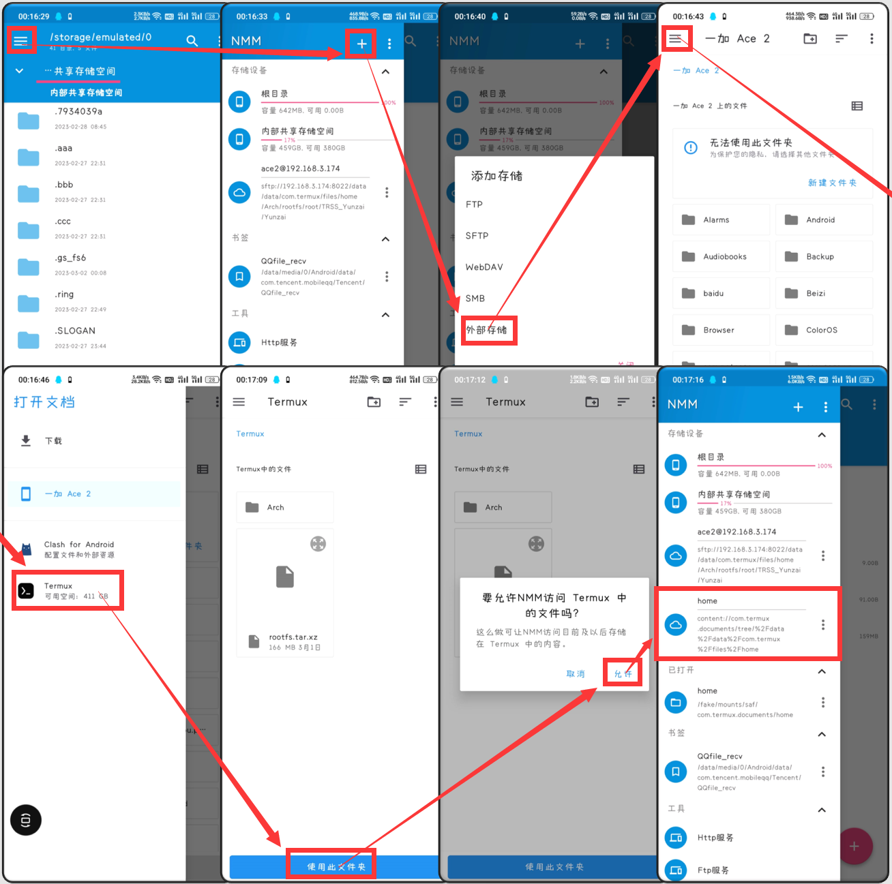

如图所示，选择左上角展开，点击加号，点击外部存储，点击左上角展开，点击Termux，点击底部使用此文件夹，点击允许。这样你就可以通过NMM直接进入Termux目录并管理所有文件了。

正常情况下云崽会在其中的`/TRSS_Yunzai/Yunzai`这个路径。

如果你在点击Termux后显示暂时无法加载内容(如下图)，则说明你的Termux被杀后台了。请保证Termux在后台时执行以上步骤。

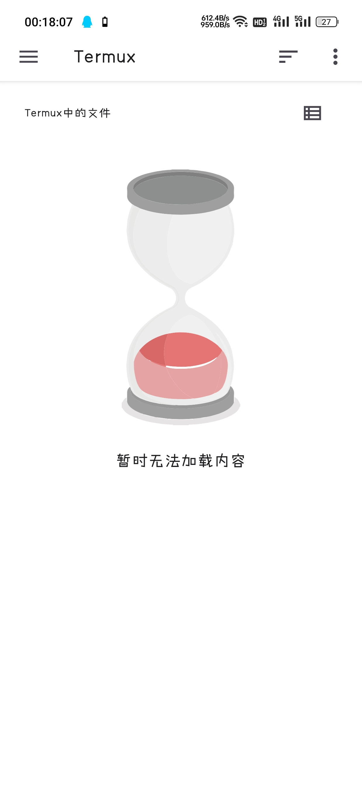

———————————分割线———————————

</details>

## 测试环境

如果你的手机环境跟我完全一致，则基本不可能出现本教程未涵盖的情况。

小米8(8+128) 系统版本：[MIUI12.5.2](https://xiaomirom.com/download/mi-8-dipper-stable-V12.5.2.0.QEACNXM/)

红米K40(12+256) 系统版本：[MIUI13.0.7](https://xiaomirom.com/download/redmi-k40-mi-11x-poco-f3-alioth-stable-V13.0.7.0.SKHCNXM/) 乌堆MIUI开发版14.0.23 [MIUI14.0.5](https://xiaomirom.com/download/redmi-k40-mi-11x-poco-f3-alioth-stable-V14.0.5.0.TKHCNXM/)

红米K50(8+256) 系统版本：[MIUI13.0.13](https://xiaomirom.com/download/redmi-k50-rubens-stable-V13.0.13.0.SLNCNXM/) 乌堆MIUI13.0.13

红米K60(16+512) 系统版本：[MIUI开发版14.0.23](https://xiaomirom.com/download/redmi-k60-poco-f5-pro-mondrian-weekly-V14.0.23.1.30.DEV/)

## 参考信息

大量内容我只是搬运，以下是实际来源网页。

当然我不保证我发的这些信息本身就是原创信息，没兴趣甄别。

为啥这么杂？问就是百度。

[git换源1](https://blog.csdn.net/qq_45723638/article/details/123494464)
[git换源2](https://blog.csdn.net/as8996606/article/details/124879105)
[部分依赖](https://blog.csdn.net/qq_39099905/article/details/125228920)
[pacman](https://zhuanlan.zhihu.com/p/383694450)
[README润色](../../../../TimeRainStarSky/TRSS-Plugin/edit/main/README.md)
[TERMUX下载](https://f-droid.org/en/packages/com.termux/)
[时雨脚本](https://trss.me/)
[memes403](https://gitee.com/realhuhu/py-plugin/issues/I6PDDV)
[Arch字体安装](https://wiki.archlinuxcn.org/wiki/%E5%AD%97%E4%BD%93)

# 遇到其他问题/需要联系我/需要使用Bot

群号 **638077675** 

答案  **火花骑士** 

[](http://jq.qq.com/?_wv=1027&k=tqiOtCVc)